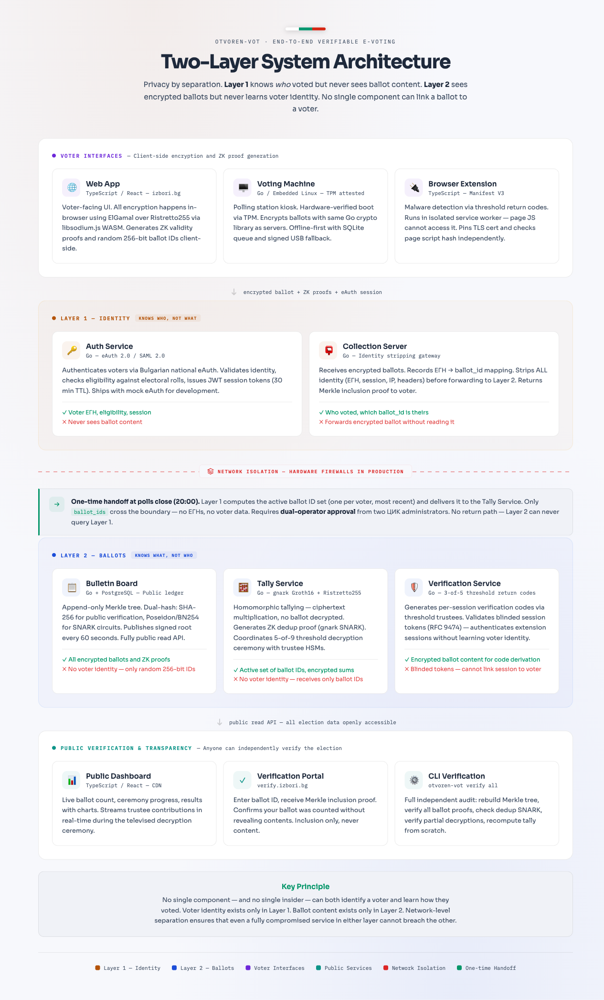
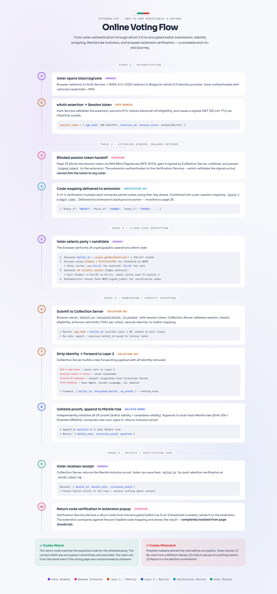
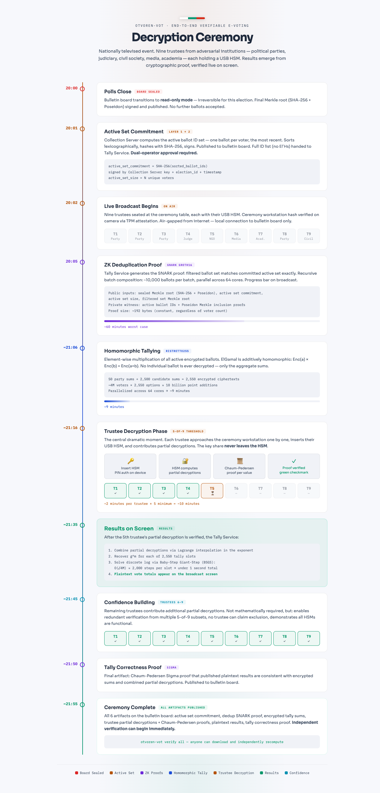
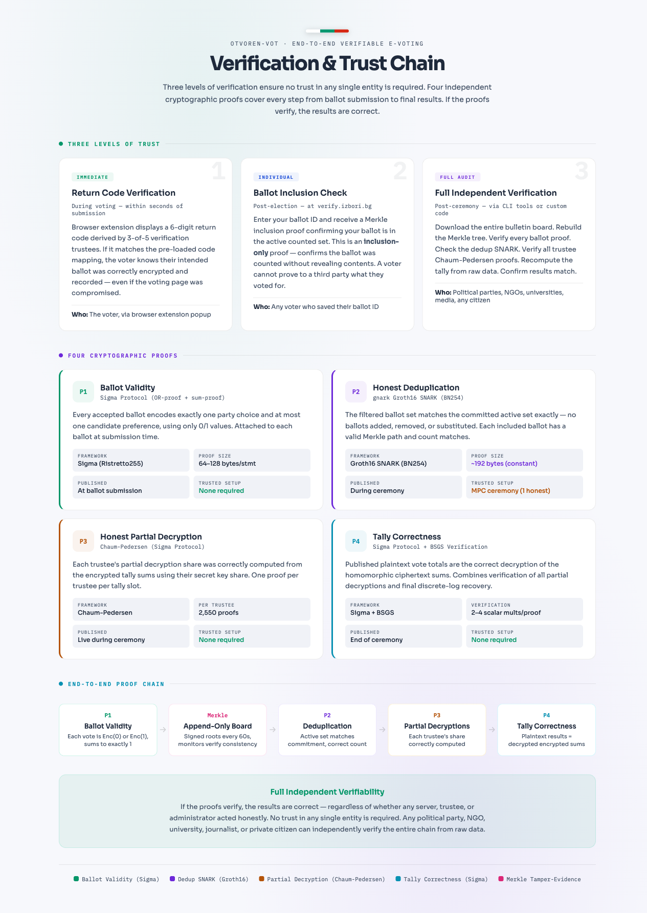

# Отворен вот / Otvoren-Vot

End-to-end verifiable e-voting system for Bulgarian national elections — Система за електронно гласуване с пълна независима проверяемост.


---

## Overview

Otvoren-Vot is an open-source, end-to-end verifiable hybrid voting system designed for Bulgarian national elections and targeted at the Central Election Commission (ЦИК / CIK) for production deployment. The system supports both online voting and in-person voting on dedicated machines, with all ballots encrypted and stored on a public bulletin board so that any observer can verify the integrity of the election independently.

Ballots are encrypted client-side using exponential ElGamal over the Ristretto255 group before they ever leave the voter's device. The bulletin board accumulates encrypted ballots in an append-only Merkle tree, publicly readable at all times. Tallying is performed homomorphically — individual ballots are never decrypted. Results are produced through a nationally televised decryption ceremony in which at least 5 of 9 threshold trustees use hardware security modules to compute partial decryptions, with zero-knowledge proofs verifying every step.

The system defends against client-side malware through a mandatory browser extension that displays return codes derived independently by verification trustees — allowing voters to confirm their vote was recorded correctly without trusting their own browser. Coercion resistance is provided by bidirectional vote override: a voter who was coerced online may override their ballot in person (and vice versa), with no observable difference on the public bulletin board. Political parties, NGOs, universities, and media organizations can download the full bulletin board and independently recompute the election result from first principles.

---

## Key Features

- Encrypted ballots on a public, append-only Merkle bulletin board
- Homomorphic tallying — no individual ballot is ever decrypted
- Bidirectional vote override for coercion resistance (online to in-person and in-person to online)
- Browser extension verification codes — detects client-side malware without a second device
- Nationally televised decryption ceremony with 5-of-9 threshold trustees using FIPS 140-3 HSMs
- ZK deduplication proof (gnark Groth16) — proves the tally includes exactly the correct set of ballots
- Full independent verifiability: CLI tools, open data API, and downloadable bulletin board
- eAuth 2.0 integration for online voter authentication (abstracted interface with mock provider)
- In-person voting machines with TPM-based software attestation and offline-first ballot queuing
- Reproducible builds for all compiled artifacts — auditors can verify binary-to-source correspondence
- WCAG 2.1 AA accessibility for the web interface; audio guidance and hardware buttons on machines

---

## Architecture

The system uses a strict two-layer architecture that enforces separation between identity and ballot data at the network level. No single component can both identify a voter and learn how they voted.

[](docs/diagrams/otvoren-vot-architecture.html)

**Layer 1 — Identity** (Auth Service + Collection Server) knows the voter's identity (ЕГН) and which ballot ID belongs to them, but never sees ballot content — ballots are encrypted before submission and the identity is stripped before forwarding. **Layer 2 — Ballots** (Bulletin Board, Tally Service, Verification Service) sees all encrypted ballots and ZK proofs but receives only random ballot IDs — it cannot link any ballot to a voter.

### System Flows

<table>
<tr>
<td width="50%">

**Online Voting Flow**

[](docs/diagrams/otvoren-vot-voting-flow.html)

From eAuth 2.0 authentication through client-side encryption, identity stripping, Merkle tree inclusion, to browser extension return code verification.

</td>
<td width="50%">

**Decryption Ceremony**

[](docs/diagrams/otvoren-vot-ceremony.html)

Nationally televised ceremony: 9 trustees with HSMs, ZK dedup proof, homomorphic tallying, threshold decryption, and live results.

</td>
</tr>
</table>

**Verification & Trust Chain**

[](docs/diagrams/otvoren-vot-verification.html)

Three levels of verification (immediate return codes, individual inclusion check, full independent audit) backed by four cryptographic proofs (ballot validity, deduplication SNARK, partial decryption, tally correctness).

> **Interactive versions:** The images above link to self-contained HTML pages with full detail. Clone the repo and open them in a browser, or browse them in [`docs/diagrams/`](docs/diagrams/).

---

## Project Structure

```
otvoren-vot/
├── crypto/              # Go — ElGamal, Merkle, Sigma proofs, gnark circuits
├── bulletin-board/      # Go — append-only log service + PostgreSQL
├── tally/               # Go — homomorphic tallying + threshold decryption
├── collection/          # Go — ballot collection, identity stripping
├── auth/                # Go — eAuth abstraction + mock provider
├── verification/        # Go — threshold return code generation
├── web/                 # TypeScript/React — voter web app
├── dashboard/           # TypeScript/React — public results dashboard
├── extension/           # TypeScript — browser verification extension
├── machine/             # Go — voting machine embedded software
├── admin/               # Python FastAPI — election management
├── deploy/              # Docker Compose + configs
├── docs/
│   ├── architecture/    # English — technical documentation
│   ├── protocol/        # English — cryptographic protocol specs
│   └── cik/             # Bulgarian — legal, threat model, cost, audit, certification
└── specs/               # Design specs and decisions
```

---

## Tech Stack

| Component | Technology |
|-----------|-----------|
| Critical-path servers | Go + libsodium (CGo) |
| ZK proofs | gnark (Go) — Groth16 with recursion |
| Bulletin board storage | PostgreSQL |
| HSM interface | Go PKCS#11 |
| Client-side encryption | Custom ElGamal on libsodium.js WASM (Ristretto255) |
| Voter web app | TypeScript / React |
| Public dashboard | TypeScript / React |
| Browser extension | TypeScript — Chrome + Firefox Manifest V3 |
| Election administration | Python FastAPI |
| Machine software | Go on embedded Linux |
| Containerization | Docker Compose |

---

## Quick Start

Coming soon — Docker Compose setup for local development.

---

## Verification

The `otvoren-vot` CLI provides independent end-to-end verification of a live or archived election:

```
otvoren-vot verify board      — download and verify full Merkle tree
otvoren-vot verify ballots    — verify all ballot validity proofs
otvoren-vot verify dedup      — verify deduplication SNARK
otvoren-vot verify tally      — verify tally correctness proof
otvoren-vot verify all        — run everything, output pass/fail report
```

All data required for verification is available through the [Open Data API](docs/architecture/) and can be downloaded as a single signed archive.

---

## Documentation

Full documentation index: [docs/README.md](docs/README.md)

- [Architecture](docs/architecture/) — service design, data flows, deployment topology (8 documents)
- [Protocol](docs/protocol/) — cryptographic protocol specifications (7 documents)
- [CIK Deliverables](docs/cik/) — threat model, legal compliance, cost projection, audit plan, certification path, PKI CP/CPS (6 documents, Bulgarian)

---

## Security

See [SECURITY.md](SECURITY.md) for the vulnerability disclosure policy and contact information.

---

## Contributing

See [CONTRIBUTING.md](CONTRIBUTING.md) for development setup, code style, and the contribution process.

---

## License

Licensed under the [European Union Public Licence v1.2 (EUPL-1.2)](LICENSE).

The EUPL-1.2 is a copyleft license approved by the European Commission and designed for public sector software. It is compatible with the GPL family and explicitly covers the distribution of software as a service.
