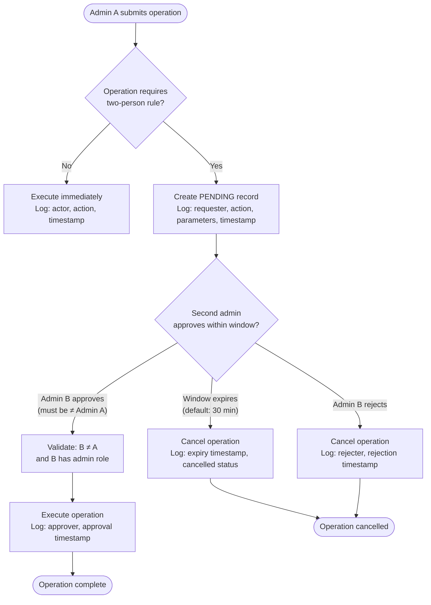

# Election Administration Service

## 1. Overview

The Election Administration Service (`admin/`) is a Python FastAPI application that provides the Central Election Commission (CIK) with tooling to manage the full lifecycle of an election — from initial configuration through the post-election ceremony and archival.

**What it is:**

- An internal service accessible only to authenticated CIK staff and trustees
- The operational control plane for all election lifecycle transitions
- An orchestrator that delegates cryptographic work to the Go services it controls

**What it is not:**

- A voter-facing service. It is not exposed to the public internet.
- On the critical voting path. Ballots submitted by voters do not transit through this service. If the admin service is unavailable during active voting, voting continues unaffected.

**Why Python:**

The admin service handles CRUD operations, multi-step workflows, and state machine transitions — none of which require the performance or low-level cryptographic control that justifies Go in the other services. Python's FastAPI framework provides auto-generated OpenAPI documentation, which serves as the primary onboarding interface for CIK staff. The admin service contains no cryptographic implementations; it orchestrates operations by calling into the Go services (Bulletin Board, Tally Service, Collection Server) via authenticated internal APIs.

---

## 2. Pre-Election Workflows

### 2.1 Create Election

An election record is the root object from which all other configuration hangs. Required fields:

| Field | Type | Description |
|-------|------|-------------|
| `name` | string | Official election name in Bulgarian Cyrillic |
| `date` | date | Election date |
| `open_time` | datetime (UTC) | When online voting opens |
| `close_time` | datetime (UTC) | When online voting closes |

Election creation is subject to the two-person rule (see Section 6).

### 2.2 Configure Parties

For each participating party:

- **Name** — official party name in Bulgarian Cyrillic
- **Logo** — image asset uploaded and stored by the admin service; distributed to the web app and voting machine software as part of the signed election configuration
- **Candidate lists** — per-constituency ordered candidate lists. Each candidate entry includes name (Cyrillic), position number within the list, and constituency identifier.

The admin service validates that the total number of parties does not exceed 50 and that no party has more than 50 candidates per constituency, in line with the cryptographic encoding constraints defined in the design specification.

### 2.3 Configure Policies

Election-wide policy settings that alter system behavior:

| Policy | Type | Description |
|--------|------|-------------|
| `extension_requirement` | enum (`required`, `recommended`, `disabled`) | Whether the browser verification extension is mandatory for online voting |
| `voting_hours_extension_enabled` | bool | Whether emergency hour extension is permitted during the election |

### 2.4 Trigger DKG Ceremony

The admin service initiates the Distributed Key Generation ceremony by:

1. Sending an authenticated request to the Tally Service to enter DKG mode
2. Providing the list of registered trustee public keys and their institution identifiers
3. Monitoring ceremony progress via Tally Service status polling
4. Collecting and verifying the output: each trustee's key share commitment and the resulting election public key

The DKG ceremony itself runs as a protocol between the trustees' HSMs and the Tally Service. The admin service is an orchestrator, not a participant — it never handles key material.

### 2.5 Register Trustees and Verify Key Shares

Each of the 9 trustees registers with the admin service prior to the DKG ceremony:

- Trustee identity (name, institution, HSM public key)
- Role assignment (full trustee vs. verification trustee subset for return code generation)

After the DKG ceremony completes, the admin service records each trustee's share commitment and flags any trustee whose verification failed.

### 2.6 Publish Signed Election Configuration

Once all pre-election steps are complete and a second admin has approved the configuration (two-person rule), the admin service submits the signed election configuration to the Bulletin Board. The configuration package contains:

- Election metadata (name, date, open/close times)
- Party and candidate data
- Election public key (output of the DKG ceremony)
- Policy settings
- The admin service's own signature over the above

Publishing to the Bulletin Board is a one-way, irreversible action. After publication, party and candidate data is locked; only emergency controls remain available.

---

## 3. During-Election Workflows

### 3.1 Monitoring Dashboard

The admin service exposes a real-time monitoring view aggregating metrics from the Go services:

| Metric | Source |
|--------|--------|
| Total ballots cast (online) | Collection Server |
| Total ballots cast (in-person, synced) | Collection Server |
| Ballot validation error rate | Collection Server |
| Bulletin Board append latency | Bulletin Board |
| Merkle root publication lag | Bulletin Board |
| Verification service return code success rate | Verification Service |
| Service health status | All services (health endpoints) |

All monitoring data is read-only. The admin service polls the Go services; no Go service sends unsolicited data to the admin service.

### 3.2 Emergency Controls

Three emergency operations are available during an active election, all subject to the two-person rule:

**Extend voting hours.** Moves the `close_time` of the election forward. The updated close time is pushed to the Collection Server and published as an amendment to the signed election configuration on the Bulletin Board. In-person voting machines continue their session independently; extension applies to online voting only.

**Pause online voting.** Instructs the Collection Server to reject new ballot submissions without terminating the election. In-person voting at physical polling stations continues unaffected — machines are not networked to the admin service and continue operating autonomously. Useful for responding to an active online attack while preserving the in-person voting channel.

**Issue system-wide alert.** Publishes an alert message to the voter-facing web application and the public dashboard. Used for scheduled maintenance windows or voter guidance announcements. Alert text is recorded in the audit trail.

### 3.3 Strict Access Boundary

**The admin service has no access to ballot content or voter-ballot mappings.** Specifically:

- It cannot read encrypted ballot ciphertexts from the Bulletin Board (only the Tally Service and public verifiers do this)
- It cannot read the `ЕГН → ballot_id` mapping table held exclusively by the Collection Server
- It cannot correlate a specific voter's identity with any action on the bulletin board

This boundary is enforced at the network and API layer: the admin service's service certificate grants it access only to the administrative endpoints of each Go service, not their data-plane endpoints.

---

## 4. Post-Election Workflows

### 4.1 Initiate Ceremony Sequence

After polls close, the admin service orchestrates a fixed, ordered sequence of operations. Each step must complete and be approved before the next begins.

**Step 1 — Seal the Bulletin Board.** The admin service sends an authenticated seal request to the Bulletin Board. After sealing, the board accepts no further ballot appends. The current Merkle root is signed and published as the final root.

**Step 2 — Trigger deduplication.** The admin service signals the Collection Server to compute the active ballot ID set (one ballot ID per voter, the most recent). The active set commitment — `hash(sorted(active_ballot_ids))`, signed by the Collection Server — is published to the Bulletin Board. The active set itself (ballot IDs only, no voter identities) is forwarded to the Tally Service. Active set computation is subject to the two-person rule (see Section 6).

**Step 3 — Start trustee phase.** The admin service opens the trustee participation interface. Trustees connect their HSMs to the ceremony workstation. The Tally Service conducts the threshold decryption protocol. The admin service monitors progress and records each trustee's participation.

### 4.2 Publish Results

After the trustee decryption phase completes and the final tally correctness proof is generated by the Tally Service, the admin service submits the results package to the Bulletin Board for public publication. The results package includes the plaintext vote totals, the tally correctness proof, and references to all partial decryption proofs.

### 4.3 Export Signed Archive

The admin service constructs and exports a signed long-term archive for judicial and historical retention. The archive contains:

- Full Bulletin Board contents (all ballots, Merkle tree)
- All ZK proofs (deduplication, partial decryptions, tally correctness)
- Active set commitment and Layer 1 signature
- Ceremony transcript (trustee participation log, HSM proof outputs)
- Admin service audit trail for the election (see Section 7)
- SHA-256 manifest of all archive contents, signed by the admin service

The archive is exported as a structured directory tree compressed and signed. It does not contain voter identity data or the `ЕГН → ballot_id` mapping; those remain under judicial seal with Layer 1.

---

## 5. Access Control

Three roles exist in the admin service. Roles are assigned per-user and are scoped to a specific election.

| Capability | CIK Admin | CIK Observer | Trustee |
|---|:---:|:---:|:---:|
| Create / configure election | Yes | No | No |
| Configure parties and candidates | Yes | No | No |
| Configure policies | Yes | No | No |
| Trigger DKG ceremony | Yes | No | No |
| Register trustees | Yes | No | No |
| Publish election configuration | Yes | No | No |
| View monitoring dashboard | Yes | Yes | No |
| Issue emergency controls | Yes | No | No |
| Initiate ceremony sequence (seal, dedup, trustee phase) | Yes | No | No |
| Participate in trustee decryption phase | No | No | Yes |
| View ceremony progress | Yes | Yes | Yes |
| Publish results | Yes | No | No |
| Export signed archive | Yes | No | No |
| View audit trail (read-only) | Yes | Yes | No |
| Approve pending two-person-rule operations | Yes (second admin only) | No | No |

**Authentication.** All admin service users authenticate with client certificates issued by the election PKI (see design specification Section 5.5). Username/password authentication is not used. Each role is bound to a certificate distinguished name.

**Session management.** Sessions are short-lived (1-hour JWT, signed by the admin service's private key). All session activity is logged to the audit trail. Concurrent sessions from the same certificate are permitted to support monitoring from multiple workstations, but each session is individually recorded.

---

## 6. Two-Person Rule

Certain operations carry irreversible or high-impact consequences. For these operations, a single authorized admin cannot act unilaterally — a second, distinct admin account must explicitly approve before the operation executes.

### 6.1 Covered Operations

| Operation | Phase |
|-----------|-------|
| Election creation | Pre-election |
| Trigger DKG / key generation | Pre-election |
| Publish signed election configuration | Pre-election |
| Issue emergency controls (extend hours, pause online voting) | During election |
| Active set computation and commitment | Post-election (ceremony) |

### 6.2 Approval Flow

### 6.3 Mechanism

**Pending state.** When a covered operation is submitted, it is written to the `pending_approvals` table with status `PENDING`. The operation is not forwarded to any downstream service in this state. The requesting admin receives a confirmation that the operation is awaiting approval.

**Notification.** All CIK admins are notified of pending approvals via the admin dashboard (polling every 30 seconds). External notification (email) is out of scope for the first release.

**Approval constraint.** The approving account must satisfy two conditions:
1. It must be a different account from the requester (enforced by comparing certificate distinguished names, not just user IDs).
2. It must hold the CIK Admin role.

An admin cannot approve their own request even if they log in under a different session. The system compares the certificate DN of the requester against the certificate DN of the approver.

**Approval window.** The default window is 30 minutes, configurable per deployment (not per operation). If no approval or rejection is received within the window, the operation transitions to `EXPIRED` status and is cancelled automatically. Both expiry and cancellation are appended to the audit trail.

**Rejection.** Any CIK admin (including the requester) may explicitly reject a pending operation before the window expires. Rejection is immediate and logged.

**Window configuration.** The approval window duration is set in the admin service's environment configuration (`APPROVAL_WINDOW_SECONDS`, default `1800`). Changes to this value require a service restart and are logged at startup.

---

## 7. Immutable Audit Trail

### 7.1 Storage

All admin actions are recorded in an append-only PostgreSQL table (`admin_audit_log`). The table is insert-only at the application layer: no UPDATE or DELETE statements are issued by any application code path. Database-level row security policies prohibit modification or deletion by the application role. The schema is:

| Column | Type | Description |
|--------|------|-------------|
| `id` | UUID | Immutable record identifier |
| `created_at` | timestamptz | Wall-clock time of the event (server time, NTP-synchronized) |
| `election_id` | UUID | Election this action belongs to (nullable for pre-election setup) |
| `actor_dn` | text | Certificate distinguished name of the acting user |
| `actor_role` | text | Role of the acting user at time of action |
| `action` | text | Enumerated action code (e.g., `ELECTION_CREATE`, `DKG_TRIGGER`, `EMERGENCY_PAUSE`) |
| `parameters` | jsonb | Action-specific parameters (sanitized; no secrets, no voter data) |
| `status` | text | `REQUESTED`, `PENDING_APPROVAL`, `APPROVED`, `REJECTED`, `EXPIRED`, `COMPLETED`, `FAILED` |
| `approver_dn` | text | Certificate DN of the approving admin (null for non-two-person-rule actions) |
| `approval_at` | timestamptz | Timestamp of approval (null if not applicable) |
| `related_record_id` | UUID | References a prior audit record (e.g., approval references the request row) |

### 7.2 What Is Logged

Every action taken through the admin service produces at least one audit record. This includes:

- All reads of sensitive configuration (e.g., viewing the trustee list, opening the monitoring dashboard)
- All write operations (configuration changes, policy updates, ceremony steps)
- All two-person-rule lifecycle events (request, approval, rejection, expiry)
- All authentication events (login, logout, failed authentication)
- All emergency control actions and their outcomes
- Service startup and configuration changes

The `parameters` field captures the full input to the operation (e.g., for an election creation, the name, date, and open/close times are recorded). No field ever contains voter identity data, ballot content, or cryptographic key material.

### 7.3 Retention Period

Audit records are retained for a minimum of 5 years following the certification of election results. This covers the Bulgarian legal challenge period and provides sufficient history for any post-election parliamentary or judicial review.

### 7.4 Access for Judicial Review

The audit trail is readable by CIK Admins and Observers at all times through the admin service's UI and API. For formal judicial review proceedings, the database table can be exported as a signed, tamper-evident archive by a CIK Admin. The export is itself logged as an audit event.

Court-appointed auditors granted judicial access receive a read-only database credential scoped exclusively to the `admin_audit_log` table for the relevant election. No write access is granted. Access grant and revocation are each logged.
