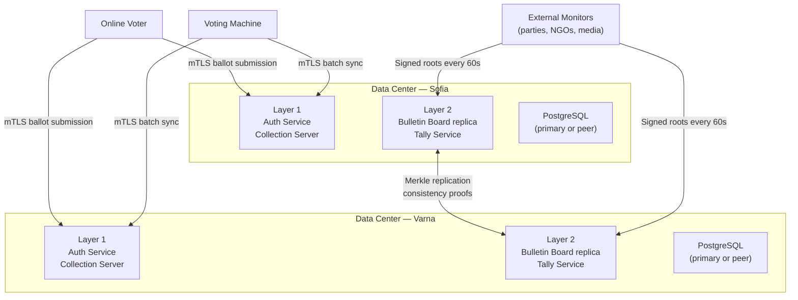

# Infrastructure

This document describes the infrastructure design for the otvoren-vot system, covering the dual data center topology, network isolation, availability characteristics, DDoS posture, graceful degradation, reproducible build verification, and web security.

---

## 1. Dual Data Center Design

The system operates across two data centers in an active-active configuration.

### 1.1 Topology

| Property | Value |
|----------|-------|
| Locations | Sofia (DC1) + Varna (DC2) |
| Distance | ~450 km |
| Mode | Active-active |
| Vote acceptance | Both DCs receive and process votes |
| Bulletin board | Both DCs maintain replicas |
| Consistency mechanism | Merkle tree (consistency proofs between replicas) |

### 1.2 Active-Active Vote Processing

Both data centers independently receive encrypted ballot submissions — from online voters and from voting machines syncing over the network. A voter's submission is directed to one DC; if that DC is unreachable, the client retries against the other. There is no primary/secondary distinction during the election.

### 1.3 Bulletin Board Consistency

The bulletin board is an append-only Merkle tree maintained in PostgreSQL at the application layer. Both DC replicas maintain the same Merkle tree. Consistency between replicas is verified via standard Merkle consistency proofs: any verifier can confirm that a newer root is a valid extension of a prior root. If the two replicas diverge, the inconsistency is immediately detectable by any external monitor comparing the signed roots from each DC.

---

## 2. Docker Compose Development Setup

For local development and demonstration, all system services run in a single Docker Compose file.

**Compose includes:**

- All Layer 1 services: Auth Service, Collection Server
- All Layer 2 services: Bulletin Board, Tally Service, Verification Service
- Supporting services: Web app, Dashboard, Admin API
- Local PostgreSQL instance (single container, no replication)
- Mock eAuth provider (ships with the Auth Service; configured via environment variable)
- Simulated trustees (9 processes with in-process HSM stubs for DKG and threshold decryption)
- Local CA for development certificates (auto-issued on `compose up`)

The development setup does not replicate the dual DC topology or the network isolation boundaries of production. Docker Compose network isolation (separate named networks for Layer 1 and Layer 2) approximates the one-way communication policy but is not a security boundary.

**Location:** `deploy/docker-compose.yml`

---

## 3. Production Network Isolation

Network separation between Layer 1 and Layer 2 is a hard security requirement. In production, this is enforced at the physical and hardware level, not in software.

### 3.1 Layer Separation

| Control | Layer 1 | Layer 2 |
|---------|---------|---------|
| Physical infrastructure | Separate servers | Separate servers |
| Network segment | Isolated VLAN/subnet | Isolated VLAN/subnet |
| Firewall | Hardware firewall | Hardware firewall |
| Cross-layer communication | One-way only: Collection Server → Bulletin Board | No return path to Layer 1 |

### 3.2 One-Way Communication Policy

The Collection Server (Layer 1) submits encrypted ballots to the Bulletin Board (Layer 2) via a single, narrow API endpoint. No Layer 2 service can initiate a connection to any Layer 1 service. This is enforced by stateful hardware firewall rules that permit only the specific source IP, destination IP, port, and protocol of that one internal API call.

The Bulletin Board's public read API is accessible from external networks (for independent verifiers), but write access is restricted to Layer 1 and requires mTLS with a valid service certificate.

The one-time deduplication handoff (Layer 1 → Layer 2 Tally Service after polls close) uses the same one-way enforcement: Layer 1 pushes the active ballot ID set; Layer 2 cannot request it.

---

## 4. Merkle Root Tamper-Evidence

The append-only property of the bulletin board is enforced at the application layer. External tamper-evidence is provided through signed Merkle root publication and independent monitoring.

### 4.1 Signed Root Publication

Every 60 seconds during the election, the Bulletin Board signs the current Merkle root with its service private key and publishes it to `/api/v1/board/root`. The signature covers the root hash and the timestamp.

### 4.2 External Monitor Distribution

Signed roots are simultaneously pushed to multiple independent monitors:

- Monitors operated by each registered political party
- Monitors operated by independent NGOs
- Monitors operated by media organizations

Each monitor stores the full sequence of signed roots it receives. Monitors are operated on infrastructure independent of the election system.

### 4.3 Consistency Verification

Any monitor, at any time, can verify:

1. Each root in the sequence is correctly signed by the Bulletin Board's service key
2. Each root is a valid Merkle consistency extension of the previous root (no entries were removed or modified)

If the Bulletin Board retroactively modifies or deletes an entry, the Merkle root changes. This change is detectable by any monitor that holds the prior signed root, because the new root will not be a consistent extension of the old one.

### 4.4 Post-Election Archive

After the election, the complete sequence of signed Merkle roots is published as part of the election archive. Independent auditors can verify the full chain of Merkle consistency from the first root to the final sealed root.

---

## 5. Availability and Load Management

### 5.1 Expected Load

| Metric | Value |
|--------|-------|
| Online voters | ~500,000 |
| Voting window | 12 hours |
| Average throughput | ~12 votes/second |
| Peak throughput | ~100 votes/second (morning and evening spikes) |

The system is designed to handle peak load without degradation. The Collection Server uses connection pooling and request queuing; it rejects gracefully under extreme load rather than crashing.

### 5.2 Rate Limiting

| Service | Rate limit |
|---------|-----------|
| Collection Server | Max 10 submissions per hour per authenticated voter (ЕГН) |
| Bulletin Board public read API | Per-IP rate limiting (100 req/min default, configurable; higher limits available via API key for delegated verifiers) |
| Dashboard | Served via CDN; rate limiting at CDN edge |

The per-voter rate limit of 10 submissions per hour is generous for the legitimate re-vote use case while preventing bulk abuse from a single compromised identity.

### 5.3 CDN and Network Segmentation

The voter-facing web app (`izbori.bg`) and the public dashboard are served via CDN (Cloudflare or equivalent). CDN absorbs traffic spikes, provides geographic distribution, and acts as the first layer of DDoS mitigation for public-facing surfaces.

The Collection Server and Bulletin Board are not directly accessible from the public internet. They are reached via the web app's backend, on non-public network segments. This limits direct attack surface for the critical write path.

The Bulletin Board's public read API is served from a read-only replica that can be scaled independently of the write path.

---

## 6. DDoS Protection

| Service | Protection |
|---------|-----------|
| `izbori.bg` (voter web app) | CDN with DDoS mitigation at the edge |
| Public dashboard | CDN |
| Bulletin Board public read API | CDN + independent read replica |
| Collection Server (write path) | Non-public network; not directly exposed to internet |
| Bulletin Board (write path) | Non-public network; only reachable from Layer 1 |
| Voting machines | Connect via mTLS to Collection Server; machines are clients, not exposed servers |

Separating the public-facing surfaces (web app, dashboard, read API) from the critical write infrastructure (Collection Server, Bulletin Board write path) ensures that a successful DDoS against public services does not affect vote collection. Online voting may be degraded but in-person voting continues unaffected — in-person machines queue locally and sync when connectivity returns.

---

## 7. Graceful Degradation

| Failure scenario | System behavior |
|-----------------|-----------------|
| Online voting overwhelmed | Queue submissions at the Collection Server; display estimated wait time to voter in the browser |
| Online voting fully down | In-person voting continues unaffected at all polling stations; no dependency between the two channels |
| Single machine failure at a station | Polling stations are required to have 2 or more machines; remaining machine(s) absorb the queue |
| All machines at a station fail | Voters directed to the nearest functioning polling station |
| Network connectivity lost at a station | Voting machines queue ballots locally in SQLite; automatic retry when connectivity returns; USB sync fallback if network never returns |

There are no paper ballots in this system. The cryptographic tally is the authoritative count. Manual counting is eliminated entirely. All degradation scenarios preserve the integrity of the cryptographic record.

---

## 8. Reproducible Builds

Reproducible builds guarantee that auditors can independently verify that deployed binaries correspond exactly to the audited source code.

### 8.1 Principle

Without reproducible builds, an auditor reviews source code but has no way to verify that the compiled binary running on election infrastructure was produced from that same source. A reproducible build is bit-for-bit identical when the same source, build environment, and build instructions are used — regardless of when or where the build is performed.

### 8.2 Implementation

**Build environment:** All compilation runs inside a Docker container with a pinned base image. The container image digest is committed to the repository.

**Compiler pinning:** The Go toolchain version is pinned in `go.toolchain` in `go.mod`. The Node.js and TypeScript versions are pinned in `.nvmrc` and `package-lock.json`. No floating version references.

**Dependency pinning:** All Go module dependencies are pinned via `go.sum`. All npm dependencies are pinned via `package-lock.json`. No `latest` or range specifiers in production dependency declarations.

**Build output hashing:** After every release build, the SHA-256 hash of each compiled artifact (Go binary, WASM bundle, browser extension package, machine image) is computed and published alongside the release in the repository.

### 8.3 Verification Process

Any party can verify a build by:

1. Cloning the repository at the release tag
2. Running the build inside the provided Docker container: `docker build -f deploy/Dockerfile.build .`
3. Computing the SHA-256 hash of the output artifacts
4. Comparing against the published hashes for that release

If the hashes match, the artifact is faithful to the audited source code.

### 8.4 Machine Image Attestation

The voting machine's embedded Linux image is reproducibly built. The image hash produced by the reproducible build is the reference hash registered in each machine's TPM during pre-election provisioning.

At every boot, the TPM verifies the running image hash against this reference. If the hash does not match — indicating the software has been modified since provisioning — the machine refuses to start and displays an error for the election commission. The TPM attestation chain is the trust anchor for machine software integrity.

Auditors can independently reproduce the machine image and confirm that the TPM is attesting to the audited, unmodified software.

### 8.5 Browser Extension Reproducibility

The browser extension package submitted to the Chrome Web Store and Firefox Add-ons is reproducibly built. The published source hash in the repository matches the hash of the store-distributed package. Independent parties can rebuild the extension and confirm it matches what voters install.

---

## 9. Web Security

### 9.1 DNSSEC

The `izbori.bg` domain uses DNSSEC. DNS responses for the domain are cryptographically signed, preventing DNS hijacking and spoofing attacks that could redirect voters to a fraudulent voting site.

### 9.2 Certificate Pinning (Extension)

The browser extension pins the expected TLS certificate for `izbori.bg`. If the certificate presented by the server does not match the pinned value — indicating a MITM attack, DNS hijack, or rogue certificate — the extension blocks the page and displays a warning to the voter. This is a secondary benefit of the mandatory extension requirement; a voter without the extension would not have this protection.

### 9.3 HSTS

The `izbori.bg` domain is served with the `Strict-Transport-Security` header with a long `max-age` value. This instructs compliant browsers to refuse HTTP connections to the domain, preventing protocol downgrade attacks. The domain is also submitted to browser HSTS preload lists.

### 9.4 Content Security Policy

The voting page is served with a strict `Content-Security-Policy` header that:

- Disallows inline scripts (`script-src` without `'unsafe-inline'`)
- Restricts script sources to known, pinned origins (the `izbori.bg` origin and the bundled WASM module hash)
- Disallows unauthorized resource loading (images, fonts, stylesheets) from third-party origins

The CSP mitigates XSS attacks on the voting page. An attacker who injects malicious content into the page cannot execute scripts or exfiltrate data to external origins. Combined with the browser extension's independent verification of the JavaScript hash, the attack surface for client-side compromise is minimized.
