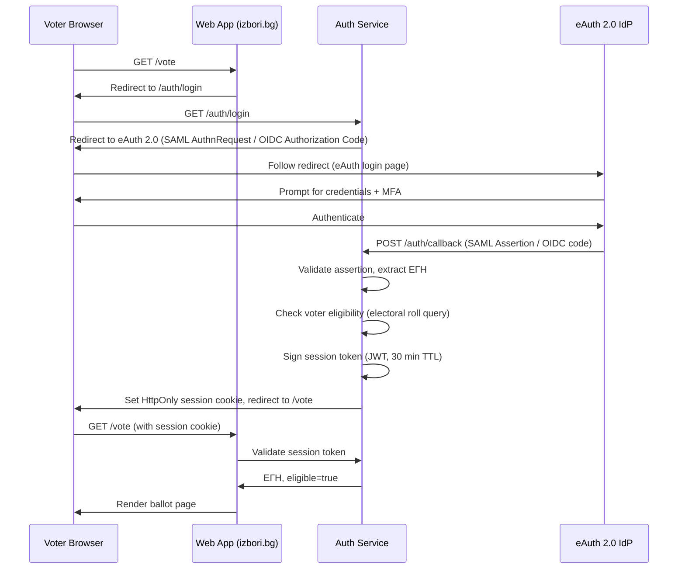

# Layer 1 — Identity Service

Layer 1 is the identity boundary of the system. It knows who voted, when, and which ballot ID was submitted. It never sees ballot content — not even in encrypted form after the ballot leaves the browser. This separation is enforced at the network level: no service in Layer 2 can initiate a connection to Layer 1.

---

## 1. Auth Service

The Auth Service is a Go service that abstracts Bulgarian national identity authentication behind a stable interface, allowing the rest of the system to be independent of the specific eAuth implementation.

### 1.1 eAuth 2.0 Integration

eAuth 2.0 is the Bulgarian government's national authentication platform, based on SAML 2.0 and OpenID Connect. The Auth Service integrates with eAuth as a Service Provider (SP) and receives assertions containing the voter's ЕГН (Единен граждански номер — the Bulgarian national ID number) and name.

Production integration requirements:
- SAML 2.0 or OIDC flow against the eAuth IdP endpoint
- SP certificate registered with the Bulgarian e-Government Agency
- Assertion encryption and signing validated on every response
- ЕГН extracted from the `urn:egov:bg:eauth:2.0:attributes:personIdentifier` attribute
- Auth Service issues a short-lived, signed session token (JWT, 30-minute expiry) to the voter's browser upon successful assertion validation

### 1.2 Mock eAuth Provider

The codebase ships with a mock eAuth provider for local development and testing. The mock implements the same interface as the production eAuth integration and is selected via configuration. It must never be enabled in production — the build pipeline enforces this with a compile-time guard.

Mock provider capabilities:
- Accepts any ЕГН entered via a simple HTML form
- Issues valid session tokens indistinguishable from production tokens (same signing key path, same JWT structure)
- Configurable list of eligible and ineligible ЕГНs for negative test cases
- No real identity data; test ЕГNs follow the standard checksum algorithm

### 1.3 Authentication Flow



The session token contains: `egn_hash` (SHA-256 of the ЕГН — never the raw ЕГН), `issued_at`, `expires_at`, `election_id`, and a `session_nonce` (256-bit random value used for blinded token generation in Section 3).

---

## 2. Collection Server

The Collection Server is a Go service that receives encrypted ballots from authenticated voters, records the identity-to-ballot mapping, and forwards the ballot to Layer 2 with all identity information removed.

### 2.1 Ballot Reception

The Collection Server exposes a single submission endpoint:

```
POST /api/v1/submit
Authorization: Bearer <session_token>
Content-Type: application/json

{
  "ballot_id": "<base64url, 256 bits>",
  "encrypted_ballot": { ... },
  "zk_proofs": { ... }
}
```

On receipt, the server performs the following validations before recording or forwarding:

1. Session token signature is valid and not expired
2. Election is currently open (within configured start/end times)
3. The ЕГН associated with the session is on the eligible voters list
4. The `ballot_id` does not already exist on the Bulletin Board (collision check; negligible probability at 2^-128 but handled gracefully with a rejection and retry instruction)
5. The `ballot_id` format is valid (256-bit base64url)

Rate limiting is applied per ЕГН: maximum 10 submissions per hour, which is generous for the override use case (a voter can change their mind multiple times) while preventing abuse.

### 2.2 EGN → ballot_id Mapping

The Collection Server maintains a private PostgreSQL database — physically isolated from Layer 2 — that stores:

```
egn_hash       TEXT NOT NULL,        -- SHA-256(ЕГН), hex-encoded
ballot_id      TEXT NOT NULL,        -- the active ballot ID for this voter
submitted_at   TIMESTAMPTZ NOT NULL, -- Collection Server receipt time (NTP-synced)
channel        TEXT NOT NULL,        -- 'online' or 'in_person'
election_id    UUID NOT NULL
```

Each new submission upserts this record: the `ballot_id` and `submitted_at` are replaced with the latest values. The previous ballot ID is retained in an immutable audit table (`egn_ballot_history`) for post-election audit purposes.

This database is the only place in the entire system where a voter's identity is linked to a ballot ID. It is sealed at poll close and made available to court-appointed auditors only under judicial order.

### 2.3 Identity Stripping Protocol

The 8-step handoff that removes all voter identity before the ballot reaches Layer 2:

```mermaid
sequenceDiagram
    participant B as Voter Browser
    participant C as Collection Server (Layer 1)
    participant BB as Bulletin Board (Layer 2)

    Note over B,C: Step 1 — Voter authenticates, receives session token
    B->>C: POST /api/v1/submit {ballot_id, encrypted_ballot, zk_proofs}
    Note over C: Step 2 — Verify session token (authenticated, election open)
    Note over C: Step 3 — Extract ЕГН from session, record ЕГН→ballot_id in private DB
    Note over C: Step 4 — Build forwarding payload: {ballot_id, encrypted_ballot, zk_proofs} — NO ЕГН, NO session token, NO IP
    C->>BB: POST /internal/v1/ballots {ballot_id, encrypted_ballot, zk_proofs}
    Note over BB: Step 5 — Validate ZK proofs (ballot validity + candidate validity)
    Note over BB: Step 6 — Append to Merkle tree, compute new root
    BB->>C: {merkle_root, inclusion_proof, position}
    Note over C: Step 7 — Verify inclusion proof against returned root
    C->>B: {ballot_id, merkle_root, inclusion_proof}
    Note over B: Step 8 — Voter browser receives receipt; extension can now request return code
```

What the Collection Server explicitly strips before forwarding:
- The voter's ЕГН and any derivative (egn_hash is never sent to Layer 2)
- The session token and session nonce
- The client IP address (the forwarding request originates from the Collection Server's own network identity)
- Any HTTP headers that could carry identity information (User-Agent, Accept-Language, etc.)

What Layer 2 receives and stores:
- `ballot_id` — a 256-bit random value generated by the voter's browser
- `encrypted_ballot` — ciphertext, opaque to Layer 2
- `zk_proofs` — validity proofs, verifiable without knowing the plaintext
- `timestamp` — the Bulletin Board's own timestamp at append time, not the Collection Server's time

---

## 3. Deduplication Bridge

When polls close, Layer 1 computes the "active set" — the definitive list of ballot IDs that should be tallied — and hands it to Layer 2's Tally Service. This is the single, one-time cross-layer transfer of data after poll close.

### 3.1 Active Set Computation

The active set is computed from the `egn_ballot_history` table. For each ЕГН that appears in the electoral roll and has submitted at least one ballot, the active ballot ID is the one with the highest precedence according to the canonical ordering rules.

**Canonical ordering (what "last" means):**

| Vote channel | Timestamp used for ordering |
|---|---|
| Online | Receipt time at the Collection Server (NTP-synchronized wall clock) |
| In-person | Machine local timestamp from the polling station batch |

The in-person timestamp precedence rule handles the USB sync scenario: if a voter cast a ballot on a polling machine at 14:00 and then voted online at 18:00, but the machine's USB sync did not reach the Collection Server until 21:00, the ordering is determined by the machine's local timestamp (14:00) vs. the online submission receipt time (18:00). The online vote at 18:00 is the later event and therefore the active one — the voter used their right to override. However, if the machine's local timestamp is 19:00 (after the online vote), the in-person ballot is the active one.

The override rules are summarized in the table in Section 5 below.

### 3.2 Active Set Publication and Handoff

After computing the active set, the Collection Server:

1. Sorts the active ballot IDs lexicographically
2. Computes the commitment: `active_set_commitment = SHA-256(sorted_ballot_ids_concatenated)`
3. Signs the commitment with the Collection Server's service key: `signed_commitment = Sign(active_set_commitment + election_id + timestamp)`
4. Publishes the signed commitment to the Bulletin Board's `/internal/v1/ceremony/active-set-commitment` endpoint
5. Transmits the full active set (ballot IDs only, no ЕГНs, no voter data) to the Tally Service via the one-time handoff endpoint
6. Seals the Collection Server's submission endpoint (no new ballots accepted)

The handoff requires dual-operator authorization: two CIK administrators must independently approve the active set computation before transmission (see Section 4.4, Dual-Operator mitigation).

The Tally Service receives:
```json
{
  "election_id": "...",
  "active_ballot_ids": ["id1", "id2", ...],
  "commitment": "sha256hex...",
  "commitment_signature": "...",
  "active_set_size": N
}
```

After this transfer, Layer 1 has no further role in the tally or ceremony.

---

## 4. Active Set Trust Assumption

**This is the most critical trust assumption in the system.**

The ZK deduplication proof (Section 2.7 of the design spec) verifies that the Tally Service filtered the bulletin board to exactly the committed active set, and that each active ballot has a valid Merkle inclusion proof. However, the ZK proof does not — and cannot — prove that Layer 1 honestly computed the active set from its voter-ballot mappings.

A compromised Layer 1 could:
- Exclude valid ballot IDs (suppress votes)
- Include ballot IDs that do not correspond to actual voters (ballot stuffing, if it also controls the Bulletin Board)
- Publish a commitment for a different set than what it transmits to the Tally Service (caught by the dedup proof, but the commitment itself could be fraudulent)

This risk is mitigated — not eliminated — by four independent controls:

### 4.1 Mitigation 1: Voter Count Cross-Check

The active set size (total number of unique voters) is published as a public input to the ZK dedup proof. This number must equal the total number of voters marked as having voted in the official electoral rolls.

Political party observers are present at every polling station and independently count voters throughout the day. Party representatives with access to the official electoral roll system can independently query the total count. Any discrepancy between the published active set size and the independently observed voter count is immediately visible and publicly flagged.

This cross-check is simple, robust, and does not require cryptographic expertise. It is analogous to comparing the number of ballot papers issued to the number of votes counted — a check that election observers have performed for centuries.

### 4.2 Mitigation 2: Post-Election Audit

Layer 1's full `egn_ballot_history` database is sealed at poll close and placed under judicial custody. The sealing event is logged and signed.

Following results certification, court-appointed auditors (independent of CIK, selected by the court) can access this database under strict protocols to verify:
- The active set was correctly derived (one ballot per ЕГН, latest by canonical ordering)
- No eligible voter's ballot was excluded without a valid reason
- No ballot IDs appear in the active set without a corresponding ЕГN record

This audit happens after results are certified, so it cannot influence the initial count. Its purpose is to provide grounds for challenging results if fraud is suspected, and to create accountability for future elections.

### 4.3 Mitigation 3: Parallel Observation

Political party representatives and NGO observers have the right to observe the deduplication process at Layer 1 in real-time. This mirrors the current practice of party observers watching ballot counting.

Specifically, observers can:
- Monitor the running total of ballots received (visible on an observer dashboard, showing counts without identity data)
- Observe the deduplication decision-making in aggregate (total submitted vs. total deduplicated) but not individual voter records
- Request the signed active set commitment immediately after it is published and before it is transmitted to Layer 2

Observers cannot see the ЕGN-to-ballot-ID mapping (that would violate ballot secrecy). They observe aggregate statistics and the final commitment.

### 4.4 Mitigation 4: Dual-Operator Requirement

The active set computation and the handoff to Layer 2 require sign-off from two distinct CIK administrator accounts. The two-person rule is enforced at the application layer:

1. The first administrator initiates the active set computation and reviews the summary statistics
2. The operation enters a "pending approval" state, visible to all administrators but locked from proceeding
3. A second, distinct administrator account reviews the statistics and approves
4. Both the initiation and approval are recorded with timestamp and administrator identity in an immutable audit table
5. Only after both approvals does the system transmit the active set to Layer 2

If the approval window (default: 30 minutes) expires without a second approval, the operation is cancelled and logged. It can be re-initiated, but each attempt is recorded.

This control ensures that a single compromised administrator account cannot unilaterally manipulate the active set.

---

## 5. Override Rules

The system supports bidirectional vote override: a voter can change their vote by submitting again, whether online or in-person, subject to the rules below.

| From | To | Result |
|---|---|---|
| Online | Online | New online ballot_id replaces previous; old ballot remains on Bulletin Board but excluded from active set |
| Online | In-person | In-person ballot_id replaces online; commission tablet transmits the new ЕГN→ballot_id mapping to Layer 1; in-person timestamp is compared against online receipt time |
| In-person | Online | Online ballot_id replaces in-person; voter re-authenticates via eAuth and submits a new encrypted ballot; online receipt time is compared against in-person machine timestamp |
| In-person | In-person | Not permitted; the commission marks the voter as having voted in the electoral roll at first visit, preventing a second approach to the machine in the same polling station |

In all override scenarios:
- All ballot IDs (original and replacement) are present on the Bulletin Board and are indistinguishable by external observers
- Only the Collection Server's active set determines which ballot is counted
- The bulletin board does not expose which ballots were overridden

---

## 6. Data Model

### 6.1 What Layer 1 Stores

**`voters` table (Layer 1 private DB):**
```
egn_hash        TEXT PRIMARY KEY,     -- SHA-256(ЕГН), hex, used as internal key
election_id     UUID NOT NULL,        -- foreign key to election
ballot_id       TEXT NOT NULL,        -- currently active ballot_id
submitted_at    TIMESTAMPTZ NOT NULL, -- Collection Server receipt time (NTP)
channel         TEXT NOT NULL,        -- 'online' | 'in_person'
```

**`egn_ballot_history` table (append-only, immutable):**
```
id              BIGSERIAL PRIMARY KEY,
egn_hash        TEXT NOT NULL,
election_id     UUID NOT NULL,
ballot_id       TEXT NOT NULL,
submitted_at    TIMESTAMPTZ NOT NULL,
channel         TEXT NOT NULL,
superseded_at   TIMESTAMPTZ,          -- NULL if currently active, set when overridden
```

**`active_set_audit` table:**
```
id              BIGSERIAL PRIMARY KEY,
election_id     UUID NOT NULL,
commitment      TEXT NOT NULL,        -- SHA-256 of sorted active ballot IDs
commitment_sig  TEXT NOT NULL,        -- Collection Server signature
active_count    INT NOT NULL,
initiated_by    TEXT NOT NULL,        -- admin account ID
approved_by     TEXT NOT NULL,        -- second admin account ID
initiated_at    TIMESTAMPTZ NOT NULL,
approved_at     TIMESTAMPTZ NOT NULL,
transmitted_at  TIMESTAMPTZ           -- set when handoff to Layer 2 completes
```

**Session store (Redis, short-lived):**
```
key:   session:<session_nonce>
value: {egn_hash, election_id, issued_at, expires_at, blinded_token_issued: bool}
TTL:   30 minutes
```

### 6.2 What Layer 1 Never Sees

- The plaintext content of any ballot (party selection, candidate preference)
- The encrypted ballot ciphertext — the Collection Server forwards it without reading or storing it
- Any data from the Bulletin Board (no return path from Layer 2 to Layer 1)
- Merkle tree internals — Layer 1 receives only the inclusion proof for the voter's receipt and does not store or interpret the tree structure

### 6.3 Blinded Session Token (issued by Collection Server)

Before forwarding the ballot, the Collection Server also issues a blinded session token that the voter's browser can pass to the Verification Service (Layer 2) for return code generation. This token is unlinkable to the voter's identity — see the design spec Section 2.8 for the full RFC 9474 RSA Blind Signatures protocol.

The Collection Server stores only a flag (`blinded_token_issued: bool`) in the session record to prevent issuing more than one blinded token per session. The token itself is not stored.
