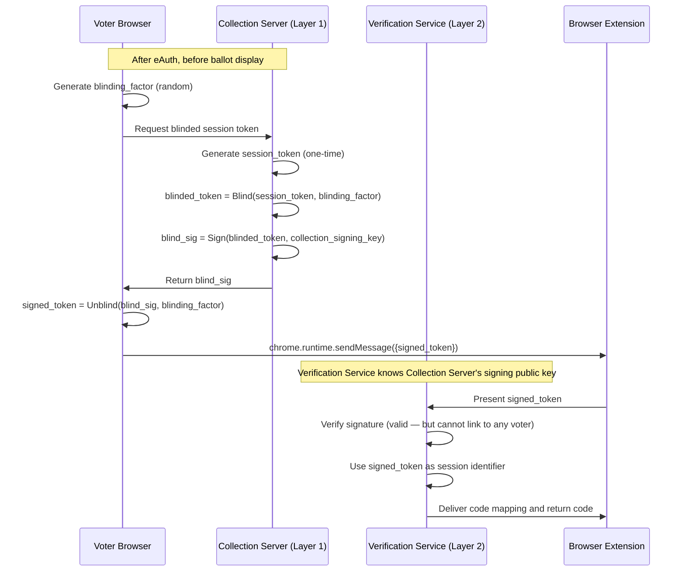
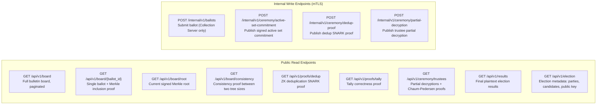

# Layer 2 — Ballot Service

Layer 2 is the cryptographic and public transparency layer of the system. It stores encrypted ballots, enforces append-only integrity, performs homomorphic tallying, generates and verifies ZK proofs, and exposes all election data to the public. It knows ballot IDs and ciphertexts; it never sees voter identity.

---

## 1. Bulletin Board

The Bulletin Board is a Go service backed by PostgreSQL. It is the canonical, publicly readable record of all submitted ballots and is the primary artifact for independent verification.

### 1.1 PostgreSQL Backend

The Bulletin Board's storage schema is intentionally simple. The cryptographic integrity property (append-only with tamper-evidence) is enforced at the application layer via the Merkle tree, not by PostgreSQL constraints alone.

**`ballots` table:**
```
ballot_id        TEXT PRIMARY KEY,       -- 256-bit base64url, voter-generated
encrypted_ballot JSONB NOT NULL,         -- ElGamal ciphertexts over Ristretto255
zk_proofs        JSONB NOT NULL,         -- ballot validity + candidate validity Sigma proofs
submitted_at     TIMESTAMPTZ NOT NULL,   -- Bulletin Board append timestamp
position         BIGINT NOT NULL UNIQUE, -- monotonically increasing leaf index in Merkle tree
merkle_root_sha  TEXT NOT NULL,          -- SHA-256 Merkle root after this append
merkle_root_pos  TEXT NOT NULL           -- Poseidon Merkle root after this append (BN254 field)
```

**`merkle_nodes` table:**
```
tree_type        TEXT NOT NULL,          -- 'sha256' | 'poseidon'
level            INT NOT NULL,           -- 0 = leaf, log2(N) = root
index            BIGINT NOT NULL,
node_hash        TEXT NOT NULL,
PRIMARY KEY (tree_type, level, index)
```

**`signed_roots` table (append-only):**
```
id               BIGSERIAL PRIMARY KEY,
signed_at        TIMESTAMPTZ NOT NULL,
root_sha256      TEXT NOT NULL,
root_poseidon    TEXT NOT NULL,
ballot_count     BIGINT NOT NULL,
signature        TEXT NOT NULL           -- ECDSA P-256 with Bulletin Board service key
```

Append-only enforcement at the application layer: the Bulletin Board service rejects any request that would UPDATE or DELETE a row in the `ballots` table. PostgreSQL's GRANT configuration gives the service account INSERT and SELECT permissions only — no UPDATE, no DELETE, no TRUNCATE. This is a defense-in-depth measure; the primary tamper-evidence is the Merkle tree and external monitors.

### 1.2 Dual-Hash Merkle Tree

The Bulletin Board maintains two parallel Merkle trees over the same set of ballot leaves, updated on every append. The two trees share the same leaf ordering (by `position`) but use different hash functions:

**SHA-256 tree (public tree):**
- Hash function: SHA-256, standard, universally available
- Purpose: external verification, API responses, inclusion proofs for voter receipts, post-election audit by any party
- Leaf value: `SHA-256(ballot_id || encrypted_ballot_bytes || zk_proofs_bytes)`
- Auditable by anyone with a standard cryptographic library

**Poseidon tree (SNARK tree):**
- Hash function: Poseidon over the BN254 scalar field, as implemented in gnark
- Purpose: used exclusively inside the gnark deduplication circuit (Section 3.3)
- Leaf value: `Poseidon(ballot_id_field_element, encrypted_ballot_commitment)`
- Approximately 250 circuit constraints per hash, versus ~25,000 for SHA-256 in a circuit
- Not intended for direct external verification; its correctness is guaranteed by the SNARK proof

Both trees are recomputed on every append. The SHA-256 root is the canonical external root. The Poseidon root is an internal implementation detail that enables the dedup proof to be computationally feasible.

**Proof validation on append:**

Before appending a ballot to either tree, the Bulletin Board validates the submitted ZK proofs:
1. Ballot validity proof (Sigma): each ciphertext element encrypts 0 or 1, and exactly one element per party vector is 1
2. Candidate validity proof (Sigma): candidate preference vector sums to 0 or 1, and is non-zero only for the selected party

A ballot whose proofs fail validation is rejected with a 422 response. The Collection Server retries with a fresh encryption and new proofs.

---

## 2. Merkle Root Tamper-Evidence Protocol

The append-only property enforced by the application layer is verifiable by external parties through a signed root publication and consistency verification scheme.

### 2.1 Signed Root Publication

Every 60 seconds during the election, the Bulletin Board computes the current Merkle root and publishes a signed root record:

```json
{
  "election_id": "...",
  "signed_at": "2026-04-07T08:15:00Z",
  "ballot_count": 142387,
  "root_sha256": "a3f7...",
  "root_poseidon": "0x1a2b...",
  "signature": "..."
}
```

The signature covers all fields above, signed with the Bulletin Board's ECDSA P-256 service certificate (issued by the election PKI). The signed root is published at `GET /api/v1/board/root` and simultaneously pushed to all registered external monitors via webhook.

### 2.2 External Monitors

Political parties, NGOs, universities, and media organizations can register as external monitors before the election. Each monitor receives:
- The Bulletin Board's signing certificate public key
- A webhook URL to register for real-time root pushes
- Read access to the public API

Each monitor independently stores the sequence of signed roots as they arrive. Monitors can also poll `/api/v1/board/root` at any interval for redundancy.

### 2.3 Consistency Verification

Standard Merkle consistency proofs allow any monitor to verify that each new root is a consistent forward extension of the previous root — i.e., no previously appended entry has been modified or removed.

A monitor verifies consistency between root at time T1 (with N1 ballots) and root at time T2 (with N2 > N1 ballots) by:
1. Requesting a consistency proof from `GET /api/v1/board/consistency?from={N1}&to={N2}`
2. Verifying the proof against the two stored signed roots
3. If the proof fails, the monitor knows the Bulletin Board has retroactively altered an entry between position 1 and N1

If a monitor detects an inconsistency, it publishes its stored signed root sequence as evidence. The bulletin board's own signed roots contradict each other — proof of tampering.

### 2.4 Post-Election Archive

After polls close, the complete sequence of signed roots is included in the public election archive. Auditors can verify the full chain of consistency from the first ballot to the sealed board, providing a complete tamper-evidence trail covering every minute of the election.

---

## 3. Tally Service

The Tally Service is a Go service that performs homomorphic tallying, coordinates threshold decryption, and generates the ZK deduplication proof during the decryption ceremony.

### 3.1 Homomorphic Tallying

After receiving the active ballot ID set from Layer 1 (Section 3.2 of the Layer 1 doc), the Tally Service:

1. Filters the bulletin board to only the ballots in the active set
2. For each position in the ballot encoding (one per party, plus all candidate preference positions), multiplies the corresponding ElGamal ciphertext elements across all active ballots:

```
C_tally[i] = C_1[i] * C_2[i] * ... * C_k[i]   (element-wise in the Ristretto255 group)
```

This works because exponential ElGamal is additively homomorphic:
`Enc(a) * Enc(b) = Enc(a + b)`

So `C_tally[i]` is an encryption of the sum of votes for option `i`, without ever decrypting any individual ballot.

3. The product is taken element-wise over the Ristretto255 group — standard scalar multiplication and point addition, no special SNARK operations
4. The resulting encrypted tally (one ciphertext per option) is stored and published on the Bulletin Board

For a worst-case election (50 parties, 50 candidates each = 2550 options, ~500,000 active voters), this computation involves 500,000 × 2550 = 1.275 billion group multiplications. On a 64-core server with parallelization across options, this completes in minutes.

### 3.2 ZK Deduplication Proof Generation

The deduplication SNARK proof is generated using gnark (Groth16 over BN254). It proves that the active set used for tallying was correctly derived from the Bulletin Board without revealing which ballots were excluded or the voter-ballot correspondence.

**Public inputs (visible to all verifiers):**
- SHA-256 Merkle root of the full Bulletin Board (sealed at poll close)
- Poseidon Merkle root of the full Bulletin Board (same tree, SNARK-friendly)
- Active set commitment hash (`SHA-256(sorted active ballot IDs)`)
- Active set size (number of unique voters)
- Filtered set Merkle root (root over only the active ballots)

**Private witness (held by the Tally Service, never published):**
- The list of active ballot IDs
- Merkle inclusion proofs (Poseidon) for each active ballot ID in the full bulletin board
- The encrypted ballots for each active ID

**What the circuit verifies:**
- Each ballot ID in the witness has a valid Poseidon Merkle inclusion proof against the sealed bulletin board root
- The SHA-256 of the sorted witness IDs equals the active set commitment
- The filtered set Merkle root is correctly computed from the included ballots
- The count of included ballots equals the declared active set size

**Performance:** The circuit is split into batches of approximately 10,000 ballots each. Each batch is proved independently in parallel across CPU cores, then composed into a single aggregate proof via Groth16 recursive proof composition. Estimated wall-clock time: 30–60 minutes on a 64-core server.

### 3.3 Threshold Decryption Coordination

After the dedup proof is published, the Tally Service coordinates the threshold decryption ceremony with the 9 trustees (5-of-9 threshold).

For each trustee participating in the ceremony:
1. The Tally Service sends the encrypted tally ciphertexts to the trustee's HSM
2. The HSM computes partial decryptions internally — the key share never leaves the device
3. The HSM outputs partial decryption values alongside a Chaum-Pedersen proof of correct computation for each partial decryption
4. The Tally Service verifies each Chaum-Pedersen proof immediately upon receipt and publishes the partial decryption + proof to the Bulletin Board in real time (visible on the broadcast)
5. After 5 valid partial decryptions are received, the Tally Service combines them via Lagrange interpolation to recover the plaintext sum

**Discrete log recovery:** The combined decryption reveals `g^m` (the group element encoding the sum `m`). The Tally Service recovers `m` via baby-step giant-step (BSGS) with O(√N) time and space. For N ≤ 4,000,000 voters, this requires ~2,000 steps per tally slot and completes in under 1 second across all 2,550 slots.

The remaining trustees (6–9) can continue to contribute partial decryptions after the threshold is reached, providing additional redundant verification.

---

## 4. Verification Service

The Verification Service is a Go service that generates threshold return codes for the browser extension and validates blinded session tokens.

### 4.1 Threshold Return Code Generation

The return code protocol provides client-side malware resistance by proving that the encrypted ballot submitted to the server encodes the voter's intended party selection. Return codes are generated by 3-of-5 verification trustees (a subset of the 9 election trustees who hold dedicated return code key shares).

**Session code mapping:**
1. At session start (after eAuth and before ballot display), the Verification Service requests a code mapping from the verification trustees: a per-session `{party_name → code}` mapping
2. The mapping is pushed to the voter's browser extension via the extension's background script
3. The mapping is deterministically derived from the session token and the verification trustees' key shares — same session always produces the same mapping for the same election public key

**Return code delivery:**
1. After the voter confirms their selection and the ballot is submitted to the Bulletin Board, the Verification Service receives the encrypted ballot
2. Each of the 3+ verification trustees independently computes a partial return code from the encrypted ballot using their key share
3. Partial codes are combined to produce the final return code
4. The return code is sent to the extension's background script
5. The extension displays the code and compares it against the session code mapping: match → green checkmark, mismatch → red warning

The return code is deterministic: the same encrypted ciphertext always produces the same code. A malicious client that encrypts a different party's vote will produce a different code, which will not match the expected code for the voter's intended selection.

### 4.2 Blinded Session Token Validation (RFC 9474)

The Verification Service must authenticate browser extension sessions without learning voter identity. This is achieved via RSA Blind Signatures (RFC 9474, as used in Privacy Pass):



The blinding is irreversible: the Verification Service sees a valid signature from the Collection Server but cannot determine which voter the session belongs to. This preserves the two-layer identity separation even for the return code protocol.

The Collection Server stores only a boolean flag (`blinded_token_issued`) per session to prevent issuing more than one blinded token per voting session. The token itself is not logged or stored.

---

## 5. Open Data API

All election data is publicly readable through a versioned REST API. Write endpoints are used only by internal services and require mutual TLS (mTLS) client certificate authentication.

### 5.1 Authentication

| Endpoint type | Authentication |
|---|---|
| Read (all GET endpoints) | None — fully public, no API key required |
| Write (POST endpoints used by internal services) | mTLS with a certificate from the election PKI |

### 5.2 Endpoints



**Endpoint descriptions:**

| Endpoint | Description |
|---|---|
| `GET /api/v1/board` | Returns the full bulletin board in pages. Each entry contains `ballot_id`, `encrypted_ballot`, `zk_proofs`, `submitted_at`, `position`, `merkle_root_sha`. Paginated with cursor. |
| `GET /api/v1/board/{ballot_id}` | Returns a single ballot by ID plus its SHA-256 Merkle inclusion proof. Used by voters verifying their receipt and by `verify.izbori.bg`. |
| `GET /api/v1/board/root` | Returns the current signed Merkle root record including both SHA-256 and Poseidon roots, ballot count, timestamp, and bulletin board signature. |
| `GET /api/v1/board/consistency` | Returns a Merkle consistency proof between two tree sizes (`?from=N1&to=N2`). Allows monitors to verify no retroactive modifications. |
| `GET /api/v1/proofs/dedup` | Returns the gnark Groth16 deduplication SNARK proof, public inputs, and active set commitment with Layer 1 signature. Available after poll close. |
| `GET /api/v1/proofs/tally` | Returns the tally correctness Sigma proof covering the homomorphic product and discrete log recovery. |
| `GET /api/v1/ceremony/trustees` | Returns each participating trustee's partial decryption values and Chaum-Pedersen proof of correct computation. Streamed live during the ceremony. |
| `GET /api/v1/results` | Returns final plaintext election results (vote counts per party and candidate) with the tally correctness proof. Available after ceremony completes. |
| `GET /api/v1/election` | Returns election metadata: election ID, name, start/end times, party list with candidates, and the election public key. |

### 5.3 Pagination

All list endpoints use cursor-based pagination:

- Default page size: 100 entries
- Maximum page size: 1000 entries
- The cursor is an opaque token (base64-encoded position + signature); it is not an offset
- Cursors do not expire during the election; they may be invalidated if the bulletin board is restarted (clients should handle 400 with error code `cursor_invalid` by restarting from the beginning)

### 5.4 Rate Limiting

| Endpoint class | Default limit | Notes |
|---|---|---|
| All public read endpoints | 100 requests/minute per IP | Applies to unauthenticated access |
| Delegated verifier (API key) | 1,000 requests/minute | API key issued on request to registered verifiers (parties, NGOs, universities) |
| Bulk download endpoint | 10 requests/minute per IP | `GET /api/v1/board` with large page sizes |

Clients exceeding the rate limit receive HTTP 429 with `Retry-After` header. Rate limits are configurable before each election by the CIK admin.

### 5.5 Response Envelope

All successful responses use a consistent envelope:

```json
{
  "data": { ... },
  "meta": {
    "cursor": "opaque_next_page_cursor",
    "total": 142387,
    "election_id": "...",
    "generated_at": "2026-04-07T08:15:00Z"
  },
  "signature": "base64_ecdsa_signature_over_data_and_meta"
}
```

The `signature` field contains an ECDSA P-256 signature by the Bulletin Board's service certificate, covering the `data` and `meta` fields. This allows any consumer to verify that the response was produced by the legitimate Bulletin Board and has not been modified in transit (in addition to TLS).

For single-object responses (e.g., `GET /api/v1/board/{ballot_id}`), the `meta.cursor` field is omitted.

Error responses do not use the envelope:

```json
{
  "error": {
    "code": "ballot_not_found",
    "message": "No ballot with the given ID exists on the bulletin board."
  }
}
```

Standard HTTP status codes: 200 OK, 400 Bad Request, 404 Not Found, 422 Unprocessable Entity (proof validation failure), 429 Too Many Requests, 503 Service Unavailable.

### 5.6 Versioning

The API uses URL-based versioning (`/api/v1/`). Breaking changes require a new version prefix. Old versions are supported for one full election cycle after deprecation is announced. Non-breaking additions (new fields, new endpoints) do not require a version increment.

---

## 6. Public Dashboard

The Public Dashboard is a TypeScript/React single-page application served via CDN. It provides a human-readable view of election progress and results, backed by the Open Data API. It is the primary interface for media, observers, and the general public who do not wish to use the CLI tools.

The dashboard operates in three distinct phases:

### 6.1 Before Ceremony (Polls Open)

During the voting period, the dashboard displays:

- **Ballot count:** Running total of ballots on the Bulletin Board, updated every 60 seconds (synchronized with the signed root publication interval)
- **Merkle tree visualization:** A graphical representation of the SHA-256 Merkle tree, showing the tree structure, the current root hash, and the depth. Allows observers to understand the inclusion proof structure without cryptographic expertise
- **System health indicators:** Real-time status of all Layer 2 services (Bulletin Board availability, proof validation success rate, Verification Service availability). Displayed as a simple green/yellow/red status panel
- **Election metadata:** Party names and candidate lists, pulled from `GET /api/v1/election`
- **Download links:** Links to download the current bulletin board snapshot and election public key for independent inspection

### 6.2 During Ceremony (Polls Closed, Ceremony Running)

After polls close and the decryption ceremony begins, the dashboard switches to live ceremony mode:

- **Trustee progress panel:** Shows each of the 9 trustees' status (waiting, currently participating, partial decryption submitted, proof verified). Updated in real time as trustee responses arrive at the Tally Service
- **Proof generation status:** Progress bar and estimated time remaining for the gnark deduplication proof (30–60 minutes). Once the proof is generated, a "Verify Now" link appears pointing to the CLI tool
- **Partial decryption feed:** As each trustee's partial decryption and Chaum-Pedersen proof are published to the Bulletin Board, they appear as a live feed with a green checkmark when the proof is verified
- **Live results panel:** Results appear incrementally as each trustee contributes. After the 5th trustee's decryption, the combined plaintext totals are visible. Formatted as a bar chart with party names in Bulgarian Cyrillic
- **Active set announcement:** The signed active set commitment from Layer 1 is displayed with the total voter count, alongside the independently observed count from party observers (if provided)

### 6.3 After Ceremony (Results Certified)

Once the ceremony is complete and results are published:

- **Final results:** Full election results with vote counts and percentages per party, and candidate preference breakdowns within each party. Bar charts and tables, fully accessible (WCAG 2.1 AA)
- **Seat projections:** Proportional representation seat allocation based on results (computed client-side using the Bulgarian d'Hondt formula, separately from the cryptographic tally)
- **Verification links:** Prominent links to:
  - `verify.izbori.bg` for individual ballot inclusion verification
  - CLI tool download for full cryptographic verification
  - The complete election archive (all proofs, signed roots, partial decryptions)
- **Downloadable data:** Direct download links for every artifact in `GET /api/v1/results`, `GET /api/v1/proofs/dedup`, `GET /api/v1/proofs/tally`, `GET /api/v1/ceremony/trustees`
- **Comparison view:** Side-by-side comparison of results from this election and the previous election of the same type (if available), for historical context

The dashboard is deployed as a static site on a CDN (Cloudflare or equivalent) with no server-side rendering, to absorb traffic spikes during results announcement without impacting the Bulletin Board's API availability.

---

## 7. Data Model

### 7.1 What Layer 2 Stores

**Bulletin Board (publicly readable):**
- All ballot IDs (random 256-bit values)
- All encrypted ballot ciphertexts (ElGamal over Ristretto255)
- All ballot validity ZK proofs (Sigma protocols)
- SHA-256 and Poseidon Merkle trees over all ballots
- Sequence of signed Merkle roots (every 60 seconds during election)
- Active set commitment hash and Layer 1 signature (published at poll close)
- gnark Groth16 deduplication SNARK proof and public inputs
- Encrypted tally ciphertexts (homomorphic products)
- All trustee partial decryptions and Chaum-Pedersen proofs
- Final plaintext election results
- Tally correctness Sigma proof

**Tally Service (internal, not directly stored on Bulletin Board):**
- Active ballot ID set (received from Layer 1, used for proof generation, then discarded after the proof is published)
- Intermediate SNARK witness data (in-memory only during proof generation)

### 7.2 What Layer 2 Never Sees

- Any voter's ЕГН or derivative identifying information
- Which ballot ID belongs to which voter
- The ЕGN-to-ballot-ID mapping maintained by Layer 1
- Session tokens (the blinded session token presented by the extension carries a valid signature but is cryptographically unlinkable to any voter)
- Any information about which ballots were overridden (all ballots on the Bulletin Board are identical in structure; only Layer 1 knows which are active)
- The plaintext content of any individual ballot — only the aggregate tally is ever decrypted
