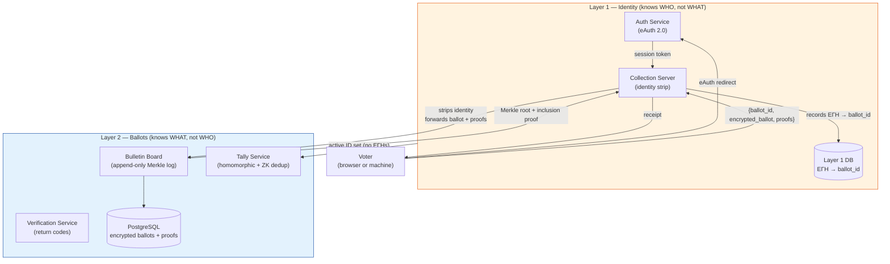
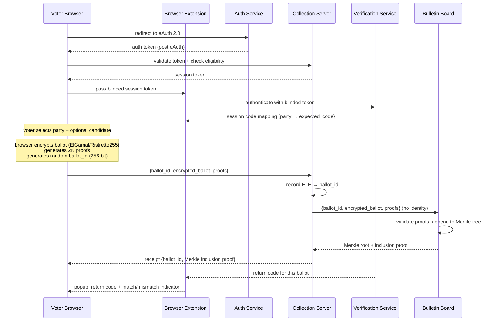
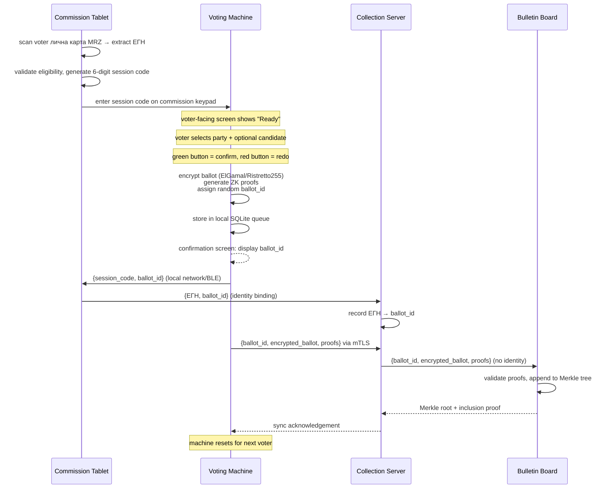

# Architecture Overview — otvoren-vot

**Document status:** Living document
**Spec reference:** `docs/superpowers/specs/2026-03-20-otvoren-vot-design.md`
**License:** EUPL-1.2

---

## 1. System Overview

Otvoren-vot is an end-to-end verifiable, hybrid online and in-person voting system designed for Bulgarian national elections. It is intended for production deployment and is structured to be presentable to CIK (Central Election Commission of Bulgaria).

The system accepts votes through two channels — an online web application authenticated via eAuth 2.0, and physical voting machines at polling stations — and counts them via a live, televised decryption ceremony conducted by nine independent trustees.

### Design Principles

**Privacy by separation.** Voter identity and ballot content are separated at the architectural level, enforced by network isolation between two independent infrastructure layers. No single component — and no single insider — can associate a ballot with the voter who cast it.

**End-to-end verifiability.** Every ballot is individually verifiable (Merkle inclusion proof), and the full tally can be independently recomputed by anyone who downloads the public bulletin board. The system produces cryptographic proofs for every step: ballot validity, deduplication, partial decryptions, and final tally correctness.

**Coercion resistance.** Voters can override their vote at any time, in either direction — a later online vote supersedes an earlier in-person vote, and vice versa. All ballots on the bulletin board are indistinguishable: random IDs, identical encrypted blobs. A coercer cannot confirm delivery, cannot see ballot content, and cannot prevent a voter from re-voting silently.

**No manual counting.** The encrypted tally is the count. There are no paper ballots. Results emerge from cryptographic computation, verified on screen before a live audience. Manual recounting is eliminated by design.

---

## 2. Two-Layer Architecture

The fundamental architectural constraint of the system is the strict separation between identity and ballot data. This separation is not merely a software abstraction — it is enforced by network isolation between two independent infrastructure deployments.



### Layer 1 — Identity Service

Layer 1 handles voter authentication and eligibility, records who has voted and which ballot ID belongs to each voter, and manages the override relationship when a voter submits more than once.

**What it knows:** Voter ЕГН, when they voted, and which ballot ID is their active ballot.
**What it never sees:** Ballot content — neither the encrypted ciphertext nor any plaintext. The collection server receives the encrypted ballot only long enough to forward it, never stores it, and strips all identity fields before forwarding.

Components: Auth Service, Collection Server.

### Layer 2 — Ballot Service

Layer 2 receives ballot submissions (stripped of all identity) from Layer 1, maintains the public append-only Merkle log, performs homomorphic tallying, and generates verification codes for the browser extension.

**What it knows:** Encrypted ballots under random IDs, ZK validity proofs, the Merkle tree.
**What it never sees:** Voter identity. No ЕГН, session token, or IP address is transmitted to or stored in Layer 2.

Components: Bulletin Board, Tally Service, Verification Service.

### The Handoff

The only direct communication path from Layer 1 to Layer 2 is a one-time, one-way handoff at polls close: Layer 1 computes the active set of ballot IDs (one per voter, the most recent), strips the ЕГNs, and delivers the ID set to the Tally Service for deduplication. The Tally Service then generates a ZK SNARK proof that the filtered ballot set matches the committed active set.

### Network Isolation

In development, layers are separated by Docker network boundaries. **In production, Layer 1 and Layer 2 run on physically separate infrastructure, enforced by hardware firewalls.** There is no return path: Layer 2 cannot query Layer 1 under any circumstances. The Bulletin Board's public read API is a separate, read-only replica.

---

## 3. Component Inventory

The system comprises eleven services organized across the two layers and supporting client surfaces.

### Auth Service (Go)

Implements the eAuth 2.0 integration via an abstracted interface. Handles the SAML/OAuth redirect flow with the Bulgarian national identity provider, validates authentication responses, and issues session tokens to authenticated voters. Ships with a mock eAuth provider for development and testing; the production integration is documented but not live without government provisioning. The abstraction layer means the mock and production providers are interchangeable without changing downstream components.

### Collection Server (Go)

The gateway of Layer 1. Receives encrypted ballot submissions from authenticated voters, verifies that the election is open, checks the voter's eligibility, and enforces rate limits. Records the `ЕГН → ballot_id` mapping in the Layer 1 database. Strips all identity fields and forwards only `{ballot_id, encrypted_ballot, proofs}` to the Bulletin Board. Returns the Merkle inclusion proof and ballot ID to the voter as a receipt. At polls close, computes and publishes the active set of ballot IDs used in deduplication. Also issues blinded session tokens used to authenticate the browser extension to the Verification Service without leaking voter identity.

### Bulletin Board (Go + PostgreSQL)

The core public ledger of Layer 2. An append-only Merkle tree where each entry contains a random ballot ID, the encrypted ballot, validity ZK proofs, a timestamp, and the updated Merkle root. Publicly readable via a versioned REST API. Maintains a dual-hash Merkle structure in parallel: SHA-256 for public verification and Poseidon/BN254 for the SNARK deduplication circuit. Publishes a signed Merkle root every 60 seconds during the election, which is distributed to independent monitors (political parties, NGOs, media) for tamper-evidence. Sealed to read-only when polls close.

### Tally Service (Go)

Performs the homomorphic tallying and manages the decryption ceremony workflow. At polls close, receives the active ballot ID set from Layer 1 and filters the bulletin board accordingly. Generates the gnark Groth16 SNARK deduplication proof (using the Poseidon Merkle branch). Multiplies all active encrypted ballots element-wise to produce encrypted vote sums — no individual ballot is ever decrypted. During the ceremony, coordinates with trustee HSMs to collect partial decryptions and Chaum-Pedersen correctness proofs, combines the partial decryptions, solves the discrete logarithm to recover plaintext totals, and publishes the final tally correctness proof.

### Verification Service (Go)

Provides the client-side malware defense mechanism via threshold return codes. Operates under a 3-of-5 sub-threshold of the nine trustees. At the start of a voting session, verification trustees generate a per-session code mapping (party → expected code) and push it to the voter's browser extension. After the voter submits a ballot, each verification trustee independently derives a partial return code from the encrypted ballot; the partial codes are combined and delivered to the extension. If the displayed code matches the session mapping, the voter knows the correct ballot was submitted and recorded — even if the browser page was compromised.

### Web App (TypeScript/React)

The voter-facing online voting interface, served at `izbori.bg`. Displays parties and candidates in Bulgarian Cyrillic. Performs all ballot encryption client-side using custom exponential ElGamal built on libsodium.js WASM Ristretto255 scalar/point primitives. Generates ZK validity proofs in the browser. Generates a 256-bit random ballot ID via `crypto.getRandomValues()`. Communicates with the Collection Server for submission and receipt. Enforces the browser extension policy (required/recommended/disabled) before allowing the voter to proceed. All served JavaScript is hash-verifiable — the extension independently checks the page's script hash against a published reference.

### Dashboard (TypeScript/React)

The public election information and results dashboard. Before the decryption ceremony it displays ballot count, Merkle tree statistics, and live system health indicators. During the ceremony it streams trustee progress, proof generation status, and results as they emerge. After the ceremony it presents final results with charts, downloadable data archives, and links to CLI verification tools. Served via CDN to absorb traffic spikes.

### Browser Extension (TypeScript, Manifest V3)

The primary defense against client-side malware. Runs as a background script in a separate origin from the voting page, meaning it cannot be tampered with by JavaScript injected into the page. After eAuth, detects the `izbori.bg` domain, receives a blinded session token from the page, and authenticates to the Verification Service without revealing voter identity. Receives the session code mapping before the voter votes. After submission, receives the return code from the Verification Service and displays it — alongside a green checkmark or red warning — in the extension popup. Also pins the TLS certificate for `izbori.bg` and independently verifies the hash of the page's served JavaScript. Available for Chrome and Firefox.

### Voting Machine (Go on embedded Linux)

The polling station kiosk. Runs a full-screen Go application on a hardened read-only embedded Linux image. At every boot, the TPM verifies the software image hash against a signed reference; a mismatch halts the machine before any voter interaction. The voter-facing interface presents party and candidate selections with large touch targets and optional audio guidance. On confirmation, the machine encrypts the ballot and generates ZK proofs using the same Go crypto library as the servers. Assigns a random ballot ID and stores the encrypted ballot in a local SQLite queue. Displays the ballot ID on the confirmation screen so the voter can note it. Syncs to the Collection Server over mTLS; falls back to signed USB batch export if the network is unavailable. The machine never learns the voter's ЕГН — identity binding occurs via a session code protocol between the machine and the election commission's tablet.

### Admin Service (Python FastAPI)

The election management interface for CIK administrators. Used pre-election to create elections, configure parties and candidates, set extension and device policies, and trigger the DKG key generation ceremony. During the election it provides monitoring dashboards and emergency controls (hour extension, pause online voting). Post-election it initiates the ceremony sequence and publishes the signed results archive. All critical operations (election creation, key generation, active set computation, emergency controls) require two-person approval: a second administrator must approve within a configurable time window. All actions are recorded in an append-only audit log.

### CLI Verification Tools (Go)

A command-line toolkit (`otvoren-vot`) for independent full verification of an election. Any party, NGO, university, or individual can run these tools against the public bulletin board API to independently confirm the integrity of the election from raw data:

```
otvoren-vot verify board      — download and verify full Merkle tree
otvoren-vot verify ballots    — verify all ballot validity proofs
otvoren-vot verify dedup      — verify deduplication SNARK proof
otvoren-vot verify tally      — verify tally correctness proof
otvoren-vot verify all        — run all checks, output pass/fail report
```

---

## 4. Data Flow Diagrams

### 4.1 Online Voting Flow



The voter compares the return code shown in the extension popup against the session mapping. A match means the correctly-intended ballot was encrypted and recorded. The voter saves the ballot ID for post-election inclusion verification.

### 4.2 In-Person Voting Flow



If the network is unavailable during the election, the machine queues ballots locally. At end-of-day or when connectivity returns, the queue is flushed. If the network never becomes available, two commission members jointly authorize a signed USB export.

### 4.3 Decryption Ceremony Flow

```mermaid
sequenceDiagram
    participant L1 as Layer 1 (Collection Server)
    participant T as Tally Service
    participant BB as Bulletin Board
    participant HSM as Trustee HSMs (5 of 9)
    participant PUB as Public (broadcast)

    Note over BB: 20:00 — polls close, bulletin board sealed read-only
    L1->>L1: compute active set {ballot_id per voter}
    L1->>T: active set commitment + ID list (no ЕГНs)
    L1->>BB: publish signed active set commitment
    T->>BB: fetch all ballots; filter to active set
    T->>T: generate gnark Groth16 dedup SNARK<br/>(~30–60 min, Poseidon Merkle tree)
    T->>BB: publish dedup proof + filtered set Merkle root
    PUB->>BB: audience downloads and independently verifies
    T->>T: multiply active encrypted ballots element-wise<br/>(homomorphic product over Ristretto255)
    loop 5 or more trustees
        HSM->>T: trustee inserts HSM, enters PIN
        T->>HSM: send encrypted sums
        HSM->>HSM: compute partial decryptions internally<br/>(key share never leaves device)
        HSM->>T: partial decryption values + Chaum-Pedersen proofs
        T->>PUB: display proof verification (green checkmark)
    end
    T->>T: combine partial decryptions<br/>solve discrete log (BSGS)<br/>recover plaintext vote totals
    T->>BB: publish partial decryptions, ceremony artifacts, tally correctness proof
    T->>PUB: final results displayed on screen
```

After the ceremony, the bulletin board publishes the complete artifact set: the active set commitment with Layer 1 signature, the deduplication SNARK proof, the homomorphic tally ciphertexts, each trustee's partial decryption with Chaum-Pedersen proof, the final plaintext results, and the tally correctness proof. Any party can download and independently recompute.

---

## 5. Trust Model

The system's security rests on a set of explicit, bounded trust assumptions. No single component is fully trusted, and most sensitive operations require either threshold participation or two-person authorization.

### Per-Component Trust

| Component | Trusted to... | Not trusted to... |
|-----------|--------------|------------------|
| Auth Service | Correctly authenticate voters via eAuth | Anything relating to ballot content |
| Collection Server | Correctly record ЕГН → ballot_id mapping; correctly strip identity before forwarding | Honest computation of the active set (mitigated by two-person rule and post-election audit) |
| Bulletin Board | Append-only behavior (enforced by external monitors via signed root sequences, not by DB constraints alone) | Privacy — it is intentionally fully public |
| Tally Service | Correctly execute the homomorphic product and ZK proof generation | Knows nothing about voter identity — it operates only on anonymous ballot IDs |
| Verification Service | Threshold: requires 3-of-5 verification trustees to collude to produce a false return code | Single trustee cannot produce a convincing fake |
| Trustee HSMs | Threshold: requires 5-of-9 trustees to collude to decrypt any ballot | Fewer than 5 trustees learn nothing about plaintext content |
| Voting Machine | TPM attestation guarantees unmodified software; physical tamper-evident seals deter hardware tampering | Voter identity — machine knows only a session code, never the ЕГН |
| Browser Extension | Runs in a separate origin from the page; cannot be tampered with by page-injected scripts | Assumes the extension binary itself is unmodified — mitigated by the store distribution hash and reproducible builds |
| Admin Service | All critical operations require two-person approval; all actions are audit-logged | Has no access to ballot content or voter-ballot mappings by design |

### Key Trust Assumptions

1. **The active set is honestly computed.** The ZK dedup proof verifies that the Tally Service filtered the bulletin board correctly against the committed active set. It does not prove that Layer 1 honestly derived the active set from its voter-ballot mappings. This is the most critical trust assumption. It is mitigated by: voter count cross-check against electoral rolls, post-election judicial audit access, party observer access, and the two-person rule for active set computation.

2. **At least 5 of 9 trustees are honest.** The threshold scheme ensures that fewer than 5 colluding trustees cannot decrypt any ballot. Trustees are drawn from adversarial institutions (political parties, civil society) specifically to make collusion difficult.

3. **The election public key is authentic.** The key is distributed via multiple independent channels (bulletin board, CIK website, party websites, print media). Any channel hijack would require compromising all channels simultaneously.

4. **The browser extension binary is unmodified.** Voters install the extension from the Chrome Web Store or Firefox Add-ons. The extension package is reproducibly built, and the source hash is published in the repository. Anyone can rebuild and compare.

5. **The voting machine software is unmodified.** Enforced at every boot by TPM attestation against a signed reference hash. The embedded Linux image is reproducibly built; auditors can independently rebuild and confirm the TPM is attesting to the audited software.

---

## 6. Coercion Resistance

Vote buying is economically irrational in this system because a coercer cannot confirm delivery, cannot verify ballot content, and cannot prevent override.

### Why Confirmation Is Impossible

- All ballots on the bulletin board carry random 256-bit IDs with no connection to voter identity.
- All ballot entries are structurally identical: random ID, encrypted ciphertext, ZK proofs, timestamp.
- Re-voting produces a new entry that is indistinguishable from any other entry.
- Encrypted ballots cannot be decrypted without the cooperation of 5 of 9 trustees — and individual decryption is not part of the protocol at all.

### Bidirectional Override

A voter can change their vote at any time before polls close:

- Online → Online: re-authenticate via eAuth, new ballot ID is recorded as active.
- Online → In-person: appear at a polling station; the in-person vote becomes active.
- In-person → Online: re-authenticate via eAuth after voting in person; the online vote becomes active.

A coercer who demands a voter vote a particular way cannot prevent the voter from later overriding that vote silently. The override generates a new bulletin board entry that looks exactly like the original.

### Ballot ID Coercion Analysis

The ballot ID is displayed on the confirmation screen. A voter may note it voluntarily for post-election inclusion verification. A coercer could demand this ID. However:

- The ballot ID proves only that a ballot with that ID exists in the Merkle tree — it proves **inclusion**, never **content**. The coercer learns nothing about what was voted.
- A "vote for us or prove you voted for us" strategy fails because the ID proves nothing about choice.
- A "don't vote at all" coercion strategy is defeated by the online override: a coerced voter can return home and vote online, replacing any ballot.
- There is no physical receipt to confiscate — the ballot ID is displayed on screen. The voter can choose not to note it.

### Inclusion-Only Verification

The post-election verification portal (`verify.izbori.bg`) accepts a ballot ID and returns a Merkle inclusion proof confirming the ballot was counted. It reveals nothing about what the ballot contains. This design is deliberate: a voter cannot prove to any third party what they voted for.

---

## 7. Error Handling

### Network Failure During Submission

If the network drops after ballot encryption but before the submission receives a receipt, the encrypted ballot and its proofs are held in `sessionStorage` — not `localStorage`. This is deliberate: `sessionStorage` is cleared when the browser tab closes, so no encrypted ballot or auth token survives the session. Within the same session, the client retries the submission automatically. If the tab is closed before a receipt is received, the voter must re-authenticate and re-vote. Because the override mechanism is safe and idempotent, this is not a data-loss scenario.

### eAuth Timeout

If the eAuth session expires before the voter completes the flow, the browser redirects back to the start of the eAuth process. No ballot data is lost because encryption occurs only after the voter has confirmed their selection and the auth session is valid.

### Proof Validation Failure

If the Collection Server rejects a ballot because a ZK proof fails validation, the server returns an error code and the browser re-generates fresh randomness and re-encrypts. Proof failures are expected to be rare (they indicate a software bug or hardware RNG failure) and are surfaced as explicit errors with actionable guidance.

### Election Closed

If a voter attempts to submit a ballot after polls close, the Collection Server returns a hard rejection with a message directing the voter to the nearest polling station. The election open/close window is enforced server-side; client-side timers are informational only.

---

## 8. Verification Levels

The system provides three independent paths to trust, suitable for different actors and time horizons.

### Level 1 — Immediate (during voting)

**Online voters** receive a Merkle inclusion proof and ballot ID immediately after submission. The browser extension simultaneously displays a return code derived from the encrypted ballot by the Verification Service trustees. If the return code matches the session mapping, the voter has confirmed that the correct ballot was encrypted, transmitted, and recorded — even if the voting page was compromised by malware.

**In-person voters** receive a confirmation screen with their ballot ID immediately after pressing the confirm button. The machine's integrity is guaranteed by TPM attestation at boot: the running software is cryptographically verified to be the audited code.

### Level 2 — Individual (post-election)

After the election, any voter can visit `verify.izbori.bg`, enter their ballot ID (by typing or QR scan), and receive a Merkle inclusion proof confirming their ballot is in the active counted set at a specific tree position. This is an inclusion proof only — it confirms the ballot was counted, without revealing its contents.

### Level 3 — Delegated (parties, NGOs, universities, media)

Any party can download the entire bulletin board via the public API and run a full independent audit:

- Download all encrypted ballots and recompute the Merkle tree from scratch.
- Verify all ballot validity ZK proofs independently.
- Verify the deduplication SNARK proof against the active set commitment.
- Verify each trustee's Chaum-Pedersen partial decryption proof.
- Verify the tally correctness proof.
- Recompute the final results from raw data and confirm they match the published totals.

The CLI verification tools (`otvoren-vot verify all`) automate this full audit path. The bulletin board API also provides a single downloadable archive of all election artifacts.

---

## 9. Accessibility

### Web Application (WCAG 2.1 AA)

The voter web app targets WCAG 2.1 AA compliance throughout the voting flow.

- **Keyboard navigation:** Every interaction — party selection, candidate preference, review, confirmation — is reachable and operable without a mouse.
- **Screen reader support:** All interactive elements carry ARIA labels. Ballot choices are semantically structured (list of options with roles and states). Dynamic content updates use live regions.
- **High-contrast mode:** A toggle in the UI switches to a high-contrast theme that meets WCAG AAA contrast ratios.
- **Large text mode:** The base font size is a minimum of 18px and scales to 200% without loss of content or functionality.
- **Focus indicators:** A visible focus ring is present on all interactive elements.
- **No time pressure:** The ballot page does not expire while the voter is making selections. Only the eAuth session has a timeout, and that timeout restarts the authentication flow cleanly.

### Voting Machine

The physical machine provides dedicated accessibility paths for voters with visual or motor impairments.

- **Extra-large text and high-contrast mode:** Activated via a dedicated accessibility button on the machine before the voter begins.
- **Audio guidance:** All on-screen text is available as audio through a headphone jack. Physical NEXT and SELECT hardware buttons allow a blind voter to navigate and confirm without using the touchscreen.
- **Touch target size:** All touchscreen targets are a minimum of 44×44px.
- **Ballot ID display:** The ballot ID on the confirmation screen is shown in large, high-contrast text.

Note: the machine is paperless by design. There is no printer and no paper receipt. The ballot ID is displayed on screen; the voter may photograph or note it voluntarily.

### Browser Extension

- The extension popup is screen-reader accessible.
- The return code match/mismatch result is conveyed as both text ("Match — [Party Name]" or "Warning — mismatch") and a color indicator. The color indicator is never the sole means of conveying the result, avoiding color-blindness issues.

---

## 10. Configuration

The following settings are configurable at the election level via the Admin Service.

### Extension Policy

Controls whether the browser extension is required for online voting.

| Value | Behavior |
|-------|----------|
| `required` (default) | The voter cannot proceed to the ballot page without the extension detected. They are prompted to install it. |
| `recommended` | A warning is displayed if the extension is not detected. The voter may proceed without it. |
| `disabled` | No extension check is performed. Intended for testing or fallback scenarios only. |

The default is `required`. CIK can change this setting via the Admin Service before the election opens. The setting is published as part of the signed election configuration on the bulletin board, so any change is auditable.

### Other Election-Level Settings

- Election name, description, open and close timestamps.
- Party list: name, logo, candidate list per party (up to 50 parties, up to 50 candidates each).
- Active set computation sign-off: two-person rule enforced by the Admin Service.
- Rate limits: per-voter submission rate (default: 10 per hour), public API rate limits.
