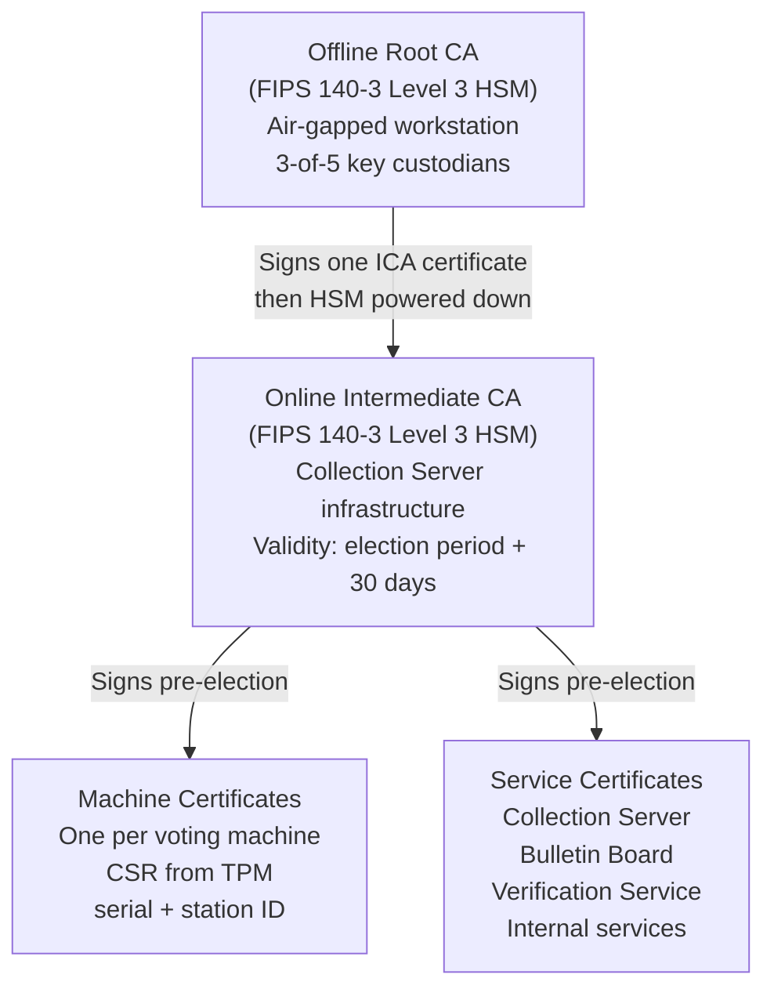

# PKI & Certificate Authority (PCI PIN RCA Model)

This document describes the Public Key Infrastructure (PKI) for the otvoren-vot system, including the CA hierarchy, root key ceremony procedures, machine certificate issuance, and key lifecycle management. The design follows the PCI PIN Security Requirements Annex A (Certificate Authority requirements) and is formally documented in the CP/CPS delivered to CIK.

---

## 1. CA Hierarchy

The offline Root CA is the trust anchor for the entire election. It signs exactly one certificate — the Intermediate CA certificate — and is then powered down and secured until key destruction. All operational certificate signing is performed by the Online Intermediate CA. End-entity certificates cover two classes: voting machines (one certificate per physical machine) and system services (Collection Server, Bulletin Board, Verification Service, and supporting internal services).

---

## 2. Root CA Key Ceremony

The root CA key ceremony follows the PCI PIN RCA model. It is a one-time event performed weeks before the election. No root CA operations take place on election day or after the intermediate CA has been signed.

### 2.1 Physical Environment

The ceremony is performed in a physically secure room with the following mandatory controls:

- Access-controlled entry: only authorized participants admitted
- No windows
- RF shielding to prevent electromagnetic eavesdropping or remote HSM interaction
- Air-gapped workstation with all network interfaces physically disabled or removed
- FIPS 140-3 Level 3 HSM connected to the ceremony workstation

### 2.2 M-of-N Split Knowledge

The root CA private key is generated inside the HSM under 3-of-5 split knowledge:

- Five key custodians each hold one key component
- No single custodian can activate the root key alone
- Any three custodians together can reconvene and activate the key (e.g., to sign a replacement intermediate CA certificate in a compromise scenario)
- Components are never combined outside the HSM — the HSM enforces the threshold internally

### 2.3 Key Custodian Requirements

Key custodians must satisfy all of the following:

- Independent individuals drawn from different institutions (e.g., drawn from the trustee institution pool)
- No two custodians from the same organization
- No family relationships between any pair of custodians
- No organizational reporting relationship between any pair of custodians
- Successful background check completed before appointment: criminal record check and financial standing review
- Custodian identities, institution affiliations, and background check results are documented in the CP/CPS

### 2.4 Ceremony Procedure

The ceremony follows a formal, pre-published script. Every step is enumerated and checked off in sequence. Deviation from the script is grounds for aborting and rescheduling the ceremony.

1. Pre-ceremony verification: facility inspection, camera setup, HSM tamper-evidence seal check, participant identity verification
2. Roll call: each of the five custodians identified, credentials inspected by witnesses
3. HSM power-on and initialization under the ceremony script
4. Root CA key generation inside the HSM; key components distributed to custodians under the 3-of-5 scheme
5. Root CA self-signed certificate generated
6. Intermediate CA certificate signed by the root CA
7. Certificate chain verification performed on the ceremony workstation
8. HSM powered down
9. HSM placed in a tamper-evident bag, sealed and signed by witnesses
10. Signed audit log produced by each participant (custodians + witnesses)

**Witnesses:** Minimum two independent witnesses, drawn from different trustee institutions. Witnesses are not key custodians. Their role is to attest that the ceremony script was followed without deviation.

**Video recording:** The entire ceremony is recorded on video. The recording is archived with the election materials and is available to court-appointed auditors under judicial order.

---

## 3. HSM Storage

After the key ceremony, the root CA HSM is stored under the following controls:

- **Tamper-evident bag:** The HSM is sealed inside a tamper-evident bag. The bag serial number is logged in the access register.
- **Dual-lock safe:** The bag is stored in a safe with two separate locks, requiring two different custodians present simultaneously to open. No single custodian holds both keys.
- **Access log:** Every safe opening is recorded with date, time, custodian identities, and stated purpose. The log is append-only and maintained by CIK.

The safe is only opened to:
- Issue a replacement intermediate CA certificate (in response to a compromise)
- Perform the post-election key destruction ceremony

---

## 4. Online Intermediate CA

The intermediate CA is the operational signing authority during the election period.

**Infrastructure:** Runs on dedicated infrastructure within the Collection Server environment. Not co-hosted with any other service. The private key is stored in an HSM (a separate device or an independent partition on the Collection Server's HSM).

**Validity period:** The intermediate CA certificate is valid for the election period plus 30 days. The 30-day buffer allows for post-election audit operations and legal challenge procedures before key destruction.

**Scope:** Signs machine certificates and service certificates only. The intermediate CA does not issue CA certificates; it is a leaf CA in the hierarchy.

**Compromise response:** If the intermediate CA is compromised, the root CA custodians are notified immediately. Three or more custodians convene, open the safe, power on the root CA HSM, revoke the compromised intermediate CA (by publishing an updated CRL from the root), and issue a replacement intermediate CA certificate. All machine and service certificates must then be reissued against the replacement intermediate.

---

## 5. Machine Certificate Issuance

Machine certificates are issued at a central CIK facility during a pre-election setup event held weeks before election day.

### 5.1 Procedure

1. Each voting machine generates a key pair inside its TPM. The private key is generated and stored in the TPM; it never leaves the chip.
2. The machine produces a CSR (Certificate Signing Request) containing the machine's public key and requested certificate attributes.
3. A CIK operator verifies the machine's hardware serial number and validates the station assignment against the official station register.
4. A second, independent CIK operator reviews and approves the issuance (two-person rule). Both approvals are logged with timestamps and operator identities.
5. The intermediate CA signs the CSR and issues the machine certificate.

### 5.2 Certificate Contents

Each machine certificate contains:

| Field | Value |
|-------|-------|
| Subject | Machine serial number |
| Station ID | Assigned polling station |
| Constituency | Electoral constituency |
| Validity period | Election day ± 3 days |
| Key usage | Client authentication (mTLS) |
| Issuer | Online Intermediate CA |

### 5.3 CA Chain Distribution

After certificate issuance, the machine is provisioned with the full CA chain: root CA certificate + intermediate CA certificate. This enables the machine to verify the Collection Server's certificate during mTLS handshake.

---

## 6. Service Certificates

The Collection Server, Bulletin Board, Verification Service, and all internal services receive certificates from the intermediate CA. These are server certificates with standard TLS server authentication key usage, plus client authentication for mTLS.

All service-to-service communication within the system uses mTLS. There are no unauthenticated internal service connections. The mTLS requirement applies to:

- Collection Server ↔ Bulletin Board (ballot submission)
- Collection Server ↔ Verification Service (session token operations)
- Tally Service ↔ Bulletin Board (post-election tally operations)
- Any administrative or monitoring connections

Machines connect to the Collection Server using mTLS, presenting their machine certificate (Section 5). The Collection Server presents its service certificate, which the machine validates against the pre-provisioned CA chain.

---

## 7. Certificate Revocation

**CRL publication:** The intermediate CA publishes a Certificate Revocation List (CRL) refreshed hourly.

**Connection-time checking:** The Collection Server checks the CRL on every incoming mTLS connection. The CRL is cached locally; the cache is refreshed every hour or immediately on receipt of a revocation event.

**Machine compromise:** If a voting machine is reported stolen, tampered with, or otherwise compromised, its certificate is immediately added to the CRL. Any subsequent connection attempt from that machine is rejected. The machine's ballots in the local SQLite queue are quarantined pending investigation; ballots already transmitted and recorded on the bulletin board are handled under the incident response procedure.

---

## 8. Key Destruction

Key destruction is a post-election ceremony performed after the election results are certified and all legal challenge periods have expired.

### 8.1 Intermediate CA Key Destruction

1. The intermediate CA HSM is wiped under the supervision of at least two CIK administrators and one independent witness.
2. The destruction is recorded on video.
3. A signed destruction audit log is produced by each participant.
4. The HSM tamper-evidence is confirmed before wiping to verify it was not accessed without authorization since the election.

### 8.2 Root CA Key Destruction

The root CA key destruction mirrors the generation ceremony:

1. Root CA custodians (minimum 3 of 5) convene.
2. Facility inspection and camera setup.
3. Safe opened (both custodians with safe keys present).
4. Tamper-evident bag inspected and serial number verified against the access log.
5. HSM powered on.
6. Root CA private key wiped from the HSM.
7. HSM powered down and physically decommissioned.
8. Signed destruction audit log produced by all participants.
9. Video recording archived.

### 8.3 Machine TPM Reset

All voting machine TPMs are reset during post-election decommissioning. This destroys the machine private key, the session-code-to-ballot-id associations, and the local audit log anchor. TPM reset is logged per machine in the central decommissioning record.

---

## 9. Machine Network Connectivity

Voting machines connect to the Collection Server over the public internet. No VPN is required.

**mTLS authentication:** The machine authenticates using its TPM-backed machine certificate (Section 5). The Collection Server authenticates using its service certificate. Both sides verify the peer certificate against the CA chain before any data is exchanged.

**No VPN:** mTLS provides equivalent mutual authentication and encryption without the operational complexity of managing certificates and tunnels for approximately 12,000 voting machines across Bulgaria. VPN infrastructure would introduce a single point of failure and additional attack surface.

**Pre-configured IPs:** Machines are pre-configured with the Collection Server's IP addresses during pre-election setup. There is no DNS dependency on election day. DNS failure or DNS spoofing cannot redirect machine connections.

**Resilience:** If the network connection drops, the machine queues ballots in its local SQLite store and retries automatically when connectivity returns. If the network never becomes available at a given polling station, the USB sync fallback (described in the offline sync section of the design spec) transports encrypted batches to the Collection Server.

---

## 10. Certificate Policy and Certification Practice Statement

Formal CP and CPS documents are delivered as part of the CIK documentation package (`docs/cik/pki/`). These documents define:

- CA hierarchy and trust model
- Roles and responsibilities (root CA custodians, intermediate CA operators, machine provisioning officers)
- Key generation, storage, and destruction procedures
- Certificate lifecycle (issuance, renewal, revocation)
- Physical security controls
- Audit requirements and log retention
- Incident response procedures

The CP/CPS is modeled on PCI PIN Security Requirements Annex A (Certificate Authority requirements).
