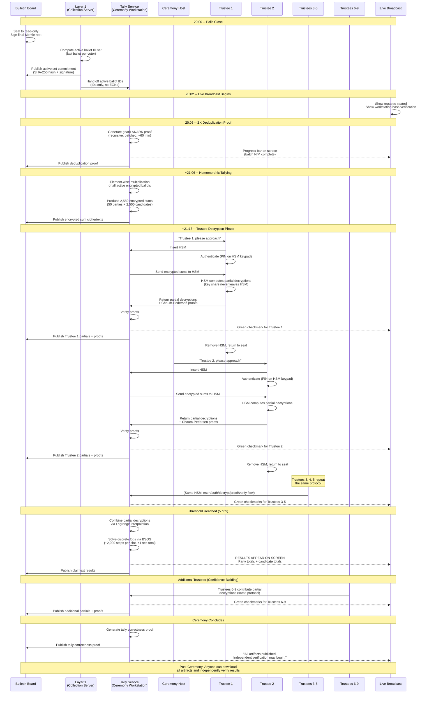

# Decryption Ceremony Protocol

**Status:** Draft
**Applies to:** otvoren-vot v1
**Last updated:** 2026-03-21

---

## 1. Overview

The decryption ceremony is the final and most publicly visible step of each election conducted with otvoren-vot. It is a nationally televised event that begins at 20:00 on election day, immediately after polls close. Nine trustees -- representatives of adversarial institutions (political parties, the judiciary, civil society, media, academia) -- are seated at a table, each holding a USB-sized Hardware Security Module (HSM). Over the course of approximately 75 minutes, the system:

1. Proves that the set of ballots being tallied is exactly the deduplicated active set (ZK deduplication proof).
2. Computes encrypted sums via homomorphic tallying.
3. Decrypts those sums using threshold decryption with a 5-of-9 quorum.
4. Publishes election results live on screen.

The entire process is publicly verifiable. Every proof, partial decryption, and intermediate artifact is published to the bulletin board. Any observer -- political party, NGO, university, journalist, or private citizen -- can independently re-derive the results from the raw data without trusting any single actor.

---

## 2. Pre-Ceremony Preparation

### 2.1 Board Seal

At 20:00 sharp, the bulletin board transitions to **read-only mode**. No further ballots are accepted. The seal is enforced by the Bulletin Board service and is irreversible for the current election. The final Merkle root (both SHA-256 public tree and Poseidon/BN254 SNARK tree) is signed by the Bulletin Board service key and published.

### 2.2 Active Set Commitment

Layer 1 (Collection Server) computes the **active ballot ID set** -- for each voter (identified by EGN in Layer 1's private database), the `ballot_id` of their most recent ballot submission. This resolves re-voting: only the last ballot per voter is included.

Layer 1 publishes the **active set commitment**: the SHA-256 hash of the sorted list of active ballot IDs, signed by the Collection Server's key. This commitment is posted to the bulletin board at 20:01.

Critically, the active set contains **ballot IDs only** -- no EGNs, no voter identities. The sorted list of active ballot IDs (without EGNs) is handed to Layer 2's Tally Service via the one-time cross-layer handoff. This is the only information that crosses the layer boundary.

### 2.3 Ceremony Workstation Boot

Before the broadcast begins, the ceremony workstation undergoes a verified boot sequence:

1. TPM attestation verifies the software image hash against a signed reference hash published days before the election.
2. Alternatively (or additionally), the software binary hash is manually computed on camera and compared to the reference hash published on the CIK website and distributed to political parties.
3. The workstation connects to the local bulletin board instance only -- it is air-gapped from the public internet for the duration of the ceremony.

---

## 3. Ceremony Timeline

Worst-case time estimates assuming maximum ballot volume (~4 million voters) and 50 parties with up to 50 candidates each (2,550 tally slots).

```
20:00  Polls close. Bulletin board sealed to read-only.
20:01  Active set commitment published (hash of sorted active ballot IDs,
       signed by Collection Server).
20:02  Live broadcast begins. Nine trustees seated at the ceremony table,
       each with their USB HSM.
20:05  ZK deduplication proof generation begins. Progress bar visible on
       the broadcast screen.
~21:05 Deduplication proof published to bulletin board (worst case ~60 min).
       Independent verification can begin immediately.
21:06  Homomorphic tallying begins (element-wise multiplication of all
       active encrypted ballots).
~21:15 Tallying complete. Encrypted sums ready (~9 minutes worst case).
21:16  Trustee decryption phase begins.
~21:35 Results appear on screen after the 5th trustee completes decryption.
~21:45 Remaining trustees (6-9) contribute additional partial decryptions
       for extra confidence.
21:50  Tally correctness proof generated and published.
~21:55 Ceremony concludes. All artifacts on the bulletin board.
```

---

## 4. ZK Deduplication Proof

The deduplication proof is the most computationally intensive step and the primary bottleneck in the ceremony timeline. It is a gnark Groth16 SNARK proof (over BN254) that demonstrates, without revealing voter identities, that the set of ballots being tallied corresponds exactly to the active set commitment published by Layer 1.

### 4.1 What the Proof Demonstrates

- Every ballot ID in the active set has a valid Poseidon Merkle inclusion proof against the bulletin board's SNARK tree root.
- The SHA-256 hash of the sorted active ballot IDs matches the published active set commitment.
- The filtered set Merkle root is correctly computed from the included ballots.
- The count of active ballots matches the declared active set size.

### 4.2 Generation Process

1. The Tally Service receives the active set (ballot IDs only) from Layer 1.
2. For each active ballot ID, it retrieves the corresponding encrypted ballot and Poseidon Merkle inclusion proof from the bulletin board.
3. It constructs the gnark circuit witness and generates the proof.
4. Recursive proof composition is used: ballots are split into batches of approximately 10,000, each batch proved independently, then composed into a single aggregate proof. Batches are proved in parallel across available CPU cores.
5. A progress bar on the broadcast screen shows batch completion (e.g., "Batch 127/400 complete").

### 4.3 Publication

The completed proof is published to the bulletin board. From this moment, anyone with access to the bulletin board data can begin independent verification using the CLI tool:

```
otvoren-vot verify dedup
```

For the full deduplication circuit specification, see [deduplication.md](deduplication.md).

---

## 5. Homomorphic Tallying

Once the deduplication proof is published, the Tally Service computes the homomorphic product of all active encrypted ballots.

### 5.1 Computation

Each encrypted ballot consists of exponential ElGamal ciphertexts over the Ristretto255 group:

- **Party vector:** One ciphertext per party (up to 50 elements). Each element encrypts 0 or 1.
- **Candidate vectors:** One ciphertext per candidate slot (up to 50 parties x 50 candidates = 2,500 elements). Each element encrypts 0 or 1.

The tallying operation is **element-wise multiplication** of all active ballots' ciphertexts:

```
TallySum[i] = ActiveBallot_1[i] * ActiveBallot_2[i] * ... * ActiveBallot_N[i]
```

Because exponential ElGamal is additively homomorphic, this produces encrypted sums:

```
TallySum[i] = Enc(vote_1[i] + vote_2[i] + ... + vote_N[i])
```

The result is:
- **50 encrypted party sums** (one per party, each encrypting the total vote count for that party)
- **2,500 encrypted candidate sums** (one per candidate slot, each encrypting the preference count)
- **Total: up to 2,550 ciphertexts**

### 5.2 Determinism

This computation is fully deterministic. Anyone who downloads the bulletin board data and the active set (identified by the deduplication proof) can independently compute the exact same encrypted sums. There is no randomness or secret input involved in this step.

### 5.3 Performance

Element-wise point multiplication of ~4 million ballots across 2,550 slots. With Ristretto255 point addition at ~1 microsecond per operation, the total computation is approximately 4M x 2,550 = ~10 billion point additions. Parallelized across 64 cores with batched multi-scalar multiplication, this completes in under 10 minutes.

---

## 6. Trustee Decryption Phase

This is the central dramatic moment of the ceremony. Each trustee, one by one, contributes their partial decryption using the key share stored inside their HSM.

### 6.1 Step-by-Step Protocol

For each trustee (minimum 5, up to all 9):

| Step | Action | Detail |
|------|--------|--------|
| **a** | Host calls trustee by name | Trustee identified publicly for accountability |
| **b** | Trustee approaches the ceremony workstation | Physically walks to the shared workstation on stage |
| **c** | Trustee inserts their USB HSM | HSM models: YubiHSM 2, Nitrokey HSM 2, or equivalent FIPS 140-3 Level 3 device |
| **d** | HSM authenticates trustee | PIN entry on HSM's own keypad, or biometric verification on the HSM itself. Authentication happens on the HSM, not on the workstation. |
| **e** | Tally Service sends encrypted sums to HSM | All 2,550 encrypted sum ciphertexts are sent to the HSM over USB |
| **f** | HSM computes partial decryptions internally | The key share **never leaves the HSM**. The HSM performs scalar multiplication of its share against each ciphertext's first component. |
| **g** | HSM outputs partial decryption values + Chaum-Pedersen proof per value | For each of the 2,550 ciphertexts, the HSM returns a partial decryption point and a non-interactive Chaum-Pedersen proof that the partial decryption is consistent with the trustee's public key share. |
| **h** | Tally Service verifies proofs on screen | Each Chaum-Pedersen proof is verified. A green checkmark appears next to the trustee's name on the broadcast display. If any proof fails, a red cross appears and the trustee is asked to retry. |
| **i** | HSM removed | Trustee physically removes their HSM and returns to their seat |
| **j** | Repeat for next trustee | Host calls the next trustee |

### 6.2 After the 5th Trustee

Once 5 valid partial decryptions have been collected (meeting the 5-of-9 threshold), the Tally Service:

1. **Combines partial decryptions** using Lagrange interpolation in the exponent. The specific Lagrange coefficients depend on which 5 trustees participated (identified by their index in the original DKG).

2. **Recovers the encrypted sums' discrete logs.** Each combined decryption yields a Ristretto255 point encoding `g^m` where `m` is the plaintext vote count. The Tally Service solves for `m` using the **Baby-Step Giant-Step (BSGS)** algorithm.

   For a maximum of ~4 million voters, BSGS requires O(sqrt(4M)) = ~2,000 steps per tally slot. With 2,550 slots, this completes in under 1 second on modern hardware.

3. **Results appear on screen.** Party vote totals and candidate preference totals are displayed live on the broadcast.

### 6.3 Trustees 6-9 (Optional, Confidence-Building)

After results are displayed, the remaining trustees (6 through 9, as available) are invited to contribute their partial decryptions. This is not mathematically required -- 5 suffices -- but serves important purposes:

- **Redundant verification:** The results can be independently re-derived using any 5-of-9 subset. Multiple subsets yielding the same result increases public confidence.
- **No trustee can claim exclusion:** Every willing trustee participates, eliminating complaints of being "shut out."
- **Proof of HSM liveness:** Demonstrates that additional HSMs are functional, reinforcing the system's resilience.

### 6.4 Tally Correctness Proof

After all participating trustees have contributed, the Tally Service generates and publishes a **tally correctness proof** -- a Sigma proof (Chaum-Pedersen family) demonstrating that the published plaintext results are consistent with the encrypted sums and the combined partial decryptions. This proof is published to the bulletin board as the final ceremony artifact.

---

## 7. Published Artifacts

After the ceremony concludes, the following artifacts are available on the bulletin board for independent verification:

| # | Artifact | Bulletin Board Endpoint | Description |
|---|----------|------------------------|-------------|
| 1 | Active set commitment + signature | `/api/v1/proofs/dedup` | SHA-256 hash of sorted active ballot IDs, signed by Collection Server key |
| 2 | ZK deduplication proof | `/api/v1/proofs/dedup` | gnark Groth16 SNARK proof (BN254) proving the active set matches the bulletin board |
| 3 | Homomorphic tally ciphertexts | `/api/v1/ceremony/trustees` | The 2,550 encrypted sum ciphertexts (Ristretto255 ElGamal) |
| 4 | Each trustee's partial decryption + Chaum-Pedersen proof | `/api/v1/ceremony/trustees` | Up to 9 sets of partial decryptions, each with per-value proofs |
| 5 | Final plaintext results | `/api/v1/results` | Party vote totals and candidate preference totals |
| 6 | Tally correctness proof | `/api/v1/proofs/tally` | Sigma proof that plaintext results match the encrypted sums |

All artifacts are signed by the Bulletin Board service key and available as a single downloadable archive.

---

## 8. Failure Scenarios

| Scenario | Response | Impact |
|----------|----------|--------|
| **HSM failure** (device malfunction during ceremony) | Skip the affected trustee. The 5-of-9 threshold tolerates up to 4 failures. | None, if at least 5 trustees succeed. |
| **Trustee refuses to participate** | Skip the trustee. Same threshold tolerance as HSM failure. | None, if at least 5 trustees participate. Refusal is recorded in the audit log. |
| **Fewer than 5 trustees available** | Ceremony cannot proceed. Must be rescheduled. This is a political crisis, not a technical one -- it means a majority of institutional trustees are compromised or uncooperative. | Election results delayed. Constitutional and legal procedures for this scenario must be defined in the election law. |
| **Network failure** (bulletin board unreachable from external networks) | The ceremony is a local computation. The workstation connects to the bulletin board over a local network. Results are computed and displayed on the broadcast. Artifacts are published to the bulletin board when external connectivity is restored. | Public verification delayed, but results are available via the broadcast. |
| **Power failure** | The ceremony workstation runs on battery backup (UPS). The broadcast feed has its own power infrastructure. | Ceremony continues. If power loss exceeds UPS capacity, ceremony is paused and resumed when power returns. All state is persisted. |
| **Chaum-Pedersen proof verification fails for a trustee** | Trustee is asked to re-insert HSM and retry. If failure persists, skip the trustee (likely HSM malfunction). | One trustee lost from the pool; tolerable if 5+ remain. |
| **BSGS discrete log fails** (result exceeds expected range) | Indicates a corrupted tally. Ceremony halted. Full audit of the bulletin board required. | This scenario should be impossible if all ballot validity proofs verified correctly. Indicates a fundamental system compromise. |

---

## 9. Ceremony Workstation

The ceremony workstation is a dedicated machine with strict security properties.

### 9.1 Hardware

- Standard server-grade hardware with a UPS (battery backup)
- USB ports for HSM connection (one at a time)
- HDMI/DisplayPort output to a large display visible to the broadcast cameras
- Network interface connected **only** to the local bulletin board instance (air-gapped from the public internet)

### 9.2 Software

- Runs the Tally Service (Go binary)
- Minimal operating system (hardened Linux, read-only root filesystem)
- No unnecessary services, no shell access during the ceremony
- Software image hash published days before the election

### 9.3 Verification Before Ceremony

Before the broadcast begins, the workstation's integrity is verified on camera:

1. **TPM attestation:** The workstation's TPM measures the boot chain and running software image. The attestation report is compared against the signed reference hash published by the CIK.
2. **Manual hash comparison:** As a redundant check, the ceremony host (or a designated technical observer) computes the hash of the Tally Service binary on camera and compares it character-by-character with the reference hash displayed on a separate, independent screen.
3. **Verification logged:** The attestation result and hash comparison are recorded in the ceremony audit log, signed, and published.

### 9.4 Air-Gap Enforcement

During the ceremony, the workstation has **no internet connectivity**. Its only network connection is to the local bulletin board service. This prevents:

- Remote interference with the decryption process
- Exfiltration of partial decryptions before publication
- Injection of malicious commands

After the ceremony concludes and all artifacts are generated, the workstation's bulletin board connection is used to publish results to the replicated bulletin board nodes (Sofia and Varna data centers). External publication happens only after the ceremony is complete.

---

## 10. Post-Ceremony Verification

The end-to-end verifiability guarantee means that **no trust in any single entity is required** to confirm the election results. Any party can independently verify the entire chain.

### 10.1 Verification Steps

An independent verifier downloads all published artifacts from the bulletin board and performs the following checks:

| Step | Verification | Tool |
|------|-------------|------|
| **(a)** | **Verify the deduplication proof.** Check the gnark Groth16 proof against the public inputs: bulletin board SNARK Merkle root, active set commitment, filtered set root, active set size. | `otvoren-vot verify dedup` |
| **(b)** | **Recompute the homomorphic product.** Multiply all active encrypted ballots element-wise to obtain the encrypted sums. Compare against the published tally ciphertexts. They must match exactly. | `otvoren-vot verify tally` |
| **(c)** | **Verify each trustee's Chaum-Pedersen proofs.** For every participating trustee, verify each of their 2,550 partial decryption proofs against the trustee's public key share (published during DKG) and the encrypted sums. | `otvoren-vot verify tally` |
| **(d)** | **Verify the tally correctness proof.** Confirm that the published plaintext results are consistent with the encrypted sums and the combined partial decryptions. | `otvoren-vot verify tally` |
| **(e)** | **Arrive at the same results.** Independently combine any 5 valid sets of partial decryptions via Lagrange interpolation, solve the discrete logs via BSGS, and confirm the plaintext totals match the published results. | `otvoren-vot verify all` |

### 10.2 Full Independent Verification

A complete verification run (`otvoren-vot verify all`) performs all of the above plus:

- Downloads and rebuilds the full Merkle tree from scratch (both SHA-256 and Poseidon variants)
- Verifies every individual ballot's validity proofs (each element is 0 or 1, vectors sum correctly)
- Verifies the Merkle consistency chain (the sequence of signed roots published during the election)
- Produces a pass/fail report for each check

This is the ultimate guarantee: if the proofs verify, the results are correct, regardless of whether any server, trustee, or administrator acted honestly.

---

## 11. Ceremony Sequence Diagram



---

## References

- [System Design Specification](../superpowers/specs/2026-03-20-otvoren-vot-design.md) -- Sections 2.5-2.7, 7.1-7.5, 8.1-8.3
- [Deduplication Circuit Specification](deduplication.md)
- Chaum, D., Pedersen, T.P. "Wallet Databases with Observers." CRYPTO 1992.
- Feldman, P. "A Practical Scheme for Non-Interactive Verifiable Secret Sharing." FOCS 1987.
- Shanks, D. "Class Number, a Theory of Factorization, and Genera." 1971. (Baby-Step Giant-Step algorithm)
- gnark documentation: https://docs.gnark.consensys.io/
